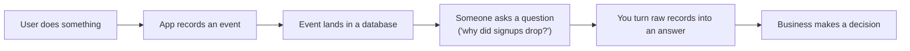
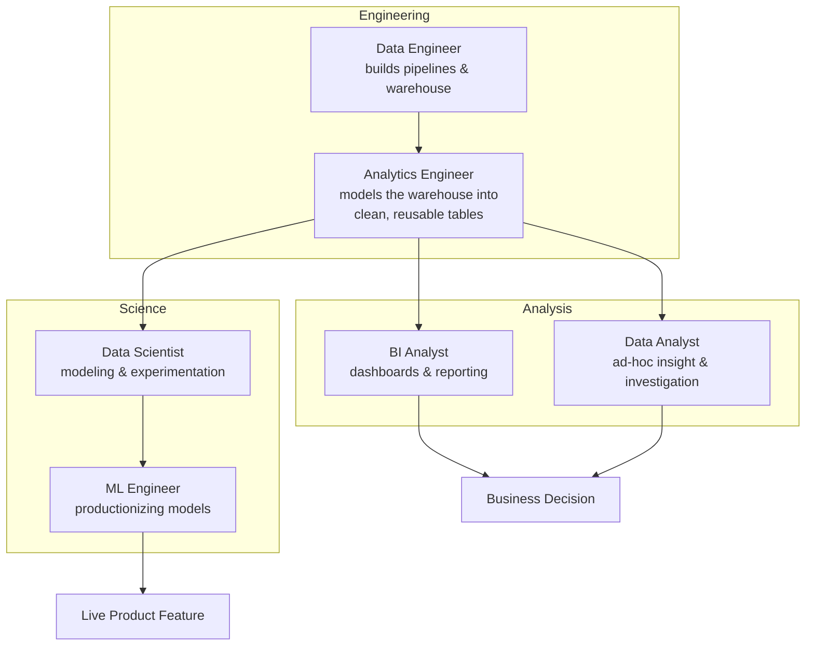
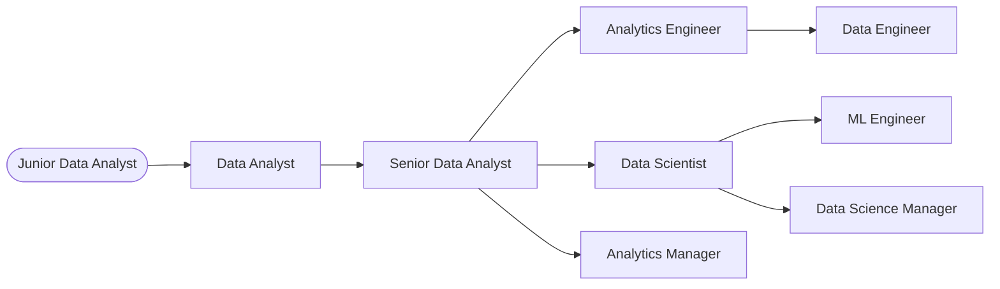

# 01 · Introduction

*Part 1 of [The Complete Data Analyst & Data Science Roadmap](00_Table_of_Contents.md)*

> 💡 **What you'll be able to do after this chapter**
> Explain, in an interview or to a non-technical stakeholder, exactly what a Data Analyst does differently from a Data Scientist, a Data Engineer, and an Analytics Engineer — and pick which of those career paths to aim for, with a realistic sense of skills, salary, and daily work.

---

## 1.1 What is Data?

Forget the textbook definition for a second. Inside a company, **data is exhaust**. Every action a user takes, every system that runs, every transaction that clears — leaves a trace. A click, a payment, a delivery scan, a support ticket, a sensor reading.

Nobody sets out to "collect data." Data is a *byproduct* of the business running. Your job, in every role this handbook covers, is to take that byproduct and turn it into something the business can act on.



> 🏢 **Real company example**
> At **Spotify**, playing a song, skipping it after 4 seconds, or adding it to a playlist are all events. None of them were generated "for analytics" — they're just what the app does when you use it. The Data team's entire job starts *after* that event already exists.

Data on its own is worthless. It becomes valuable the moment someone turns it into a decision — that transformation, from raw event to decision, is what this entire handbook teaches, one layer at a time:

```
Users → Applications → Operational Database → ETL/ELT → Data Warehouse
      → SQL → Python → Power BI → Business Decision → Machine Learning → Deployment
```

You'll see this exact pipeline again in [Chapter 02](02_How_Companies_Work.md), where each arrow gets its own deep dive.

---

## 1.2 The six roles, and how they actually differ

Job titles in data are inconsistent across companies — a "Data Analyst" at one company does what a "Data Scientist" does at another. But the *work itself* clusters into six recognizable jobs. Here's how to tell them apart by what they actually spend their day doing, not by their title.

| Role | Core question they answer | Primary tools | Output |
|---|---|---|---|
| **Business Intelligence (BI) Analyst** | "What happened, and how do I make it visible to everyone?" | SQL, Power BI / Tableau | Dashboards, recurring reports |
| **Data Analyst** | "Why did it happen, and what should we do?" | SQL, Excel, Python, Power BI | Ad-hoc analysis, insights, decks |
| **Data Scientist** | "What will happen, and how confident are we?" | Python, statistics, ML | Models, experiments, predictions |
| **Data Engineer** | "How do we move and store data reliably at scale?" | SQL, Python, Spark, Airflow, cloud | Pipelines, warehouses |
| **Analytics Engineer** | "How do we make clean, trusted data models everyone can query?" | SQL, dbt, warehouse tooling | Data models, transformation layer |
| **ML Engineer** | "How do we get a model running reliably in production?" | Python, APIs, Docker, cloud, MLOps | Deployed, monitored models |

> 📌 **Callout — the fastest way to tell two roles apart**
> Ask: *"What do they hand off, and to whom?"*
> - A **BI Analyst** hands a dashboard to an executive.
> - A **Data Analyst** hands an insight to a decision-maker.
> - A **Data Scientist** hands a model or a tested hypothesis to a Data Analyst or a product team.
> - A **Data Engineer** hands clean, reliable tables to everyone above.
> - An **Analytics Engineer** hands trusted, documented data *models* (not raw tables) to Analysts and Scientists.
> - An **ML Engineer** hands a running, monitored service to the product itself.

### How this looks inside a real company



> 🏢 **Real company example**
> At **Mercado Libre**, when a Product Manager asks "why is cart abandonment up in Brazil?", a **Data Analyst** answers it with SQL and a deck within days. If the answer becomes "we should build a model to predict who's about to abandon their cart," that becomes a **Data Scientist** project — and if it ships as a live discount-trigger in the app, an **ML Engineer** puts it into production and keeps it running.

---

## 1.3 Daily responsibilities, role by role

### BI Analyst
- Maintain and extend recurring dashboards (revenue, retention, ops metrics)
- Own metric definitions so "revenue" means the same thing to everyone
- Triage "the dashboard looks wrong" tickets
- Present weekly/monthly business reviews

### Data Analyst
- Get pulled into a Slack thread with a vague question ("are we losing money on this promo?") and turn it into a scoped analysis
- Write SQL against the warehouse, sanity-check the numbers, visualize them
- Present findings with a clear recommendation, not just a chart
- Partner with Product/Marketing/Finance stakeholders directly

### Data Scientist
- Frame a business problem as a modeling problem (classification, regression, ranking, etc.)
- Explore data, engineer features, train and validate models
- Design and read A/B test results
- Communicate uncertainty and trade-offs to non-technical stakeholders

### Data Engineer
- Build and maintain ETL/ELT pipelines
- Design warehouse schemas for reliability and query performance
- Own data quality checks, alerting, and pipeline SLAs
- Manage cloud infrastructure costs and scaling

### Analytics Engineer
- Write and test transformation logic (commonly in dbt) on top of raw warehouse data
- Document tables and columns so self-serve analytics actually works
- Own the "single source of truth" layer between raw data and everyone who queries it
- Bridge the gap between Data Engineering and Analysis

### ML Engineer
- Take a Data Scientist's notebook and turn it into a reliable service
- Build training/inference pipelines, APIs, monitoring, and retraining triggers
- Manage model versioning and rollback
- Own latency, cost, and uptime of ML in production

---

## 1.4 Career paths

None of these roles are dead ends — they're a graph, not a ladder. The most common entry point for this handbook's audience is **Data Analyst**, and the two dominant paths from there are:



> ✅ **Best practice**
> Don't try to pick your final destination on day one. Start as a Data Analyst, get fluent in SQL and business context, and let the work itself tell you whether you enjoy the "build reliable systems" side (→ Analytics/Data Engineering) or the "model uncertainty" side (→ Data Science) more.

> ⚠️ **Common mistake**
> Jumping straight to Machine Learning tutorials without ever having queried a real, messy, undocumented production database. Companies don't hire ML Engineers who can't handle dirty data — they hire Analysts who grew into it. [Chapter 08](08_Machine_Learning.md) assumes you've been through [Chapters 03–05](03_Databases.md) first for exactly this reason.

---

## 1.5 Salary ranges (indicative benchmarks)

Salaries vary enormously by country, company size, and seniority — treat these as **directional**, not contractual.

| Role | LatAm (remote, USD/yr) | US (onsite/remote, USD/yr) | EU (onsite/remote, EUR/yr) |
|---|---|---|---|
| BI Analyst | $18k – $40k | $65k – $100k | €35k – €60k |
| Data Analyst | $20k – $45k | $70k – $110k | €38k – €65k |
| Senior Data Analyst | $35k – $65k | $100k – $140k | €55k – €85k |
| Data Scientist | $30k – $60k | $110k – $165k | €55k – €95k |
| Data Engineer | $30k – $65k | $115k – $170k | €55k – €95k |
| Analytics Engineer | $30k – $60k | $110k – $155k | €55k – €90k |
| ML Engineer | $35k – $75k | $130k – $190k | €65k – €110k |

> 📌 **Callout**
> Total compensation (equity, bonuses) at large tech companies (Google, Amazon, Microsoft, Stripe) can push the upper end of the US range 30–60% higher. LatAm ranges above assume **remote work for a foreign company** — local-market-only salaries are typically 40–60% lower.

---

## 1.6 Required skills matrix

| Skill | BI Analyst | Data Analyst | Data Scientist | Data Engineer | Analytics Engineer | ML Engineer |
|---|:---:|:---:|:---:|:---:|:---:|:---:|
| SQL | ●●● | ●●● | ●●○ | ●●● | ●●● | ●●○ |
| Excel / Spreadsheets | ●●● | ●●● | ●○○ | ●○○ | ●○○ | ○○○ |
| Python | ●○○ | ●●○ | ●●● | ●●● | ●●○ | ●●● |
| Statistics | ●○○ | ●●○ | ●●● | ●○○ | ●○○ | ●●○ |
| Data Visualization (Power BI/Tableau) | ●●● | ●●● | ●○○ | ○○○ | ●○○ | ○○○ |
| Data Modeling / Warehousing | ●●○ | ●●○ | ●○○ | ●●● | ●●● | ●○○ |
| Machine Learning | ○○○ | ●○○ | ●●● | ○○○ | ○○○ | ●●● |
| Software Engineering / APIs | ○○○ | ○○○ | ●○○ | ●●● | ●●○ | ●●● |
| Business Communication | ●●● | ●●● | ●●○ | ●○○ | ●●○ | ●○○ |
| Cloud Platforms (AWS/Azure/GCP) | ●○○ | ●○○ | ●●○ | ●●● | ●●○ | ●●● |

`●●●` core to the role · `●●○` important · `●○○` useful · `○○○` rarely needed

This handbook builds these skills in the order most companies actually need them: **Databases → SQL → Python → Power BI → Projects → Machine Learning → Portfolio**, matching the pipeline from §1.1.

---

## 1.7 Recommended books

| Book | Author | Best for |
|---|---|---|
| *SQL for Data Analysis* | Cathy Tanimura | SQL fundamentals with real analytical patterns |
| *Storytelling with Data* | Cole Nussbaumer Knaflic | Turning charts into decisions people act on |
| *Python for Data Analysis* | Wes McKinney (creator of Pandas) | The definitive Pandas reference |
| *The Data Warehouse Toolkit* | Ralph Kimball | Star schema, dimensional modeling — foundational for Ch.03 |
| *Practical Statistics for Data Scientists* | Peter Bruce, Andrew Bruce, Peter Gedeck | Statistics with a practitioner's lens, not a professor's |
| *Designing Data-Intensive Applications* | Martin Kleppmann | For when you want to understand what Data Engineers actually build |
| *Hands-On Machine Learning with Scikit-Learn, Keras & TensorFlow* | Aurélien Géron | The standard practical ML reference |

## 1.8 Recommended YouTube channels

| Channel | Focus |
|---|---|
| **Luke Barousse** | Data Analyst career advice, real job-market insight |
| **Alex The Analyst** | SQL, Power BI, and Data Analyst fundamentals from scratch |
| **StatQuest with Josh Starmer** | Statistics and ML concepts explained visually, no fluff |
| **Seattle Data Guy** | Data Engineering and career strategy from an industry practitioner |
| **Ken Jee** | Data Science career paths and portfolio-building |
| **Corey Schafer** | Deep, correct Python fundamentals |
| **Guy in a Cube** | Power BI straight from a former Microsoft Power BI team member |

---

## Chapter Summary

- Data has no value until it's turned into a decision — that transformation is the job, across every role in this field.
- BI Analyst, Data Analyst, Data Scientist, Data Engineer, Analytics Engineer, and ML Engineer are six distinct jobs distinguished by *what they hand off and to whom*, not by title alone.
- Most people entering this field should start as a **Data Analyst** and branch toward Data Science or Analytics/Data Engineering based on what part of the job they enjoy.
- Skills compound in a specific order — this handbook follows that order starting in [Chapter 02](02_How_Companies_Work.md).

**Next:** [02. How Companies Work →](02_How_Companies_Work.md) — how data is actually generated and stored before anyone gets to analyze it.
