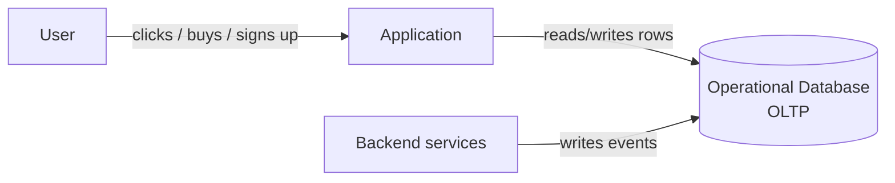
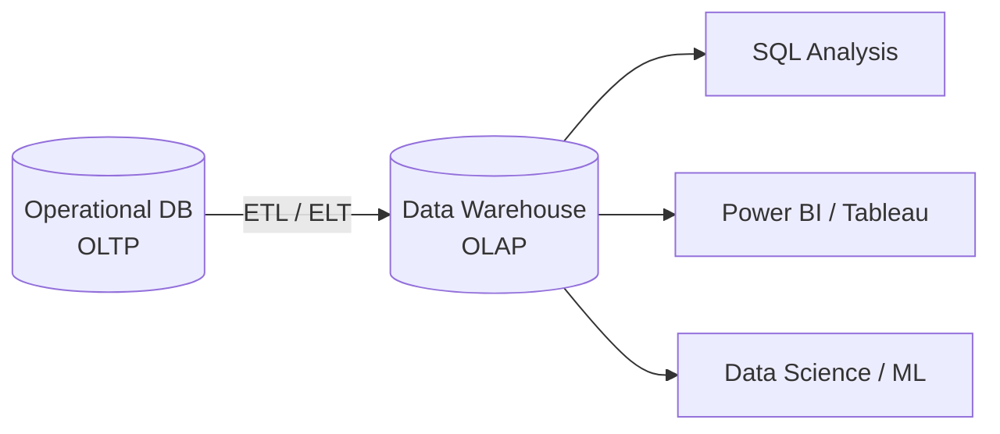
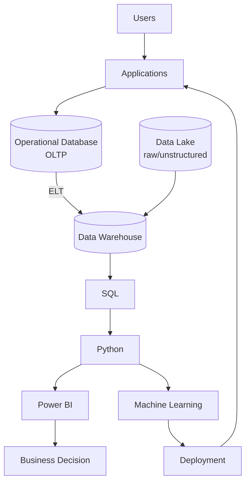

# 02 · How Companies Work

*Part 2 of [The Complete Data Analyst & Data Science Roadmap](00_Table_of_Contents.md) · Previous: [01. Introduction](01_Introduction.md)*

> 💡 **What you'll be able to do after this chapter**
> Draw and explain the real data architecture of a modern company — from a user tapping a button to an executive seeing a number on a dashboard — and know when a company reaches for a Data Warehouse vs. a Data Lake vs. a Lakehouse, and batch vs. streaming.

---

## 2.1 How data is generated

Every company runs on **applications** — the mobile app, the website, the point-of-sale system, the internal admin tool. Those applications need to remember things *right now*: did the payment go through, is the item still in stock, is the user logged in. That immediate, transactional memory lives in an **operational database** (also called OLTP — see [Chapter 03](03_Databases.md)).

> 🏢 **Real company example**
> When you add an item to your cart on **Mercado Libre**, that write goes straight into an operational database optimized for *speed and correctness of a single transaction* — not for answering "what were our top 10 categories last month?" That question needs a completely different system, which is where the rest of this chapter comes in.

---

## 2.2 Operational Database → Data Warehouse

Operational databases are built to handle thousands of small, fast read/write transactions. They are **bad** at answering big analytical questions ("total revenue by region, by month, for the last 3 years") because that kind of query scans huge amounts of data — and running that against the live database would slow down the app for real users.

So companies copy the data out into a second system, purpose-built for analysis: the **Data Warehouse**.

The process that moves and reshapes the data between these two systems is called **ETL** or **ELT**:

| | ETL (Extract, Transform, Load) | ELT (Extract, Load, Transform) |
|---|---|---|
| Order | Transform *before* loading | Transform *after* loading |
| Where transformation happens | A separate processing engine | Inside the warehouse itself |
| Common today because | Warehouses are now powerful enough to transform data at scale | Cloud warehouses (Snowflake, BigQuery, Redshift) are cheap to run big transformations in |
| Typical tooling | Informatica, legacy SSIS, custom scripts | Airbyte/Fivetran (extract+load) + dbt (transform) |

> ✅ **Best practice**
> Modern cloud-first companies default to **ELT**: land raw data in the warehouse first, then transform it with SQL/dbt where it's easy to test, version, and re-run. This is also the layer where **Analytics Engineers** live (see [01.2](01_Introduction.md#12-the-six-roles-and-how-they-actually-differ)).

> ⚠️ **Common mistake**
> Querying the operational (production) database directly for analytics. This is how junior analysts accidentally slow down — or crash — the live app. Always analyze from the warehouse or a read replica, never the primary production database.

---

## 2.3 Data Warehouse vs. Data Lake vs. Lakehouse

| | Data Warehouse | Data Lake | Lakehouse |
|---|---|---|---|
| Data shape | Structured (tables, rows, columns) | Any shape — structured, semi-structured, raw files, images, logs | Structured + unstructured, unified |
| Schema | Enforced on write (schema-on-write) | Enforced on read (schema-on-read) | Both, depending on layer |
| Best for | BI dashboards, SQL analytics | ML training data, raw logs, data science exploration | Everything — one platform for both |
| Examples | Snowflake, BigQuery, Redshift | S3 + Hive/Glue, Azure Data Lake | Databricks, Snowflake (Iceberg), BigQuery (unified) |

> 🏢 **Real company example**
> A company like **Netflix** dumps raw viewing-event logs into a **Data Lake** because the volume and variety is enormous and not every team needs it structured. The BI team then builds a curated, structured layer on top — either a classic **Data Warehouse** or, increasingly, a **Lakehouse** that lets both SQL analysts and ML teams work off the same underlying storage without duplicating data.

---

## 2.4 Batch vs. Streaming

| | Batch Processing | Streaming |
|---|---|---|
| Data moves | On a schedule (hourly, nightly) | Continuously, as events happen |
| Latency | Minutes to hours | Milliseconds to seconds |
| Typical tools | Airflow + SQL/dbt jobs, scheduled Python scripts | Kafka, Kinesis, Flink, Spark Streaming |
| Typical use case | Daily revenue dashboard, monthly reports | Fraud detection, real-time recommendations, live inventory |

> 📌 **Callout**
> Most **Data Analyst** work happens on top of **batch-processed** data — a dashboard that refreshes every morning is completely normal and expected. Streaming is a Data/ML Engineering concern you'll encounter, but rarely build yourself as an analyst.

---

## 2.5 Cloud platforms: AWS, Azure, Google Cloud

You don't need to master any cloud provider to start as a Data Analyst, but you will constantly hear these names — know what they're for.

| Provider | Warehouse | Storage (Lake) | BI Tool | Notes |
|---|---|---|---|---|
| **AWS** | Redshift | S3 | QuickSight (rare) | Most common cloud overall; often paired with Power BI or Tableau |
| **Azure** | Synapse Analytics | Azure Data Lake Storage | **Power BI** (native) | Common in enterprises already on Microsoft stack |
| **Google Cloud** | **BigQuery** | Cloud Storage | Looker / Looker Studio | Popular with tech-native, high-growth companies |

> ✅ **Best practice**
> When you see a job posting say "SQL + BigQuery" or "SQL + Snowflake," don't panic — the SQL you learn in [Chapter 04](04_SQL.md) is 90% transferable. The differences are mostly dialect syntax and how you connect, not how you think about queries.

---

## 2.6 The full picture

This is the diagram to keep in your head for the rest of the handbook — every remaining chapter drops into one node of it: [Databases](03_Databases.md) and [SQL](04_SQL.md) live in the warehouse layer, [Python](05_Python.md) and [Power BI](06_Power_BI.md) sit on top of it, and [Machine Learning](08_Machine_Learning.md) closes the loop back into the product.

---

## Chapter Summary

- Applications write to fast, transactional **operational databases** — never analyze directly against them.
- **ETL/ELT** moves and reshapes that data into a **Data Warehouse** built for analysis; modern companies favor ELT with SQL/dbt.
- **Data Lakes** hold raw/unstructured data at scale; **Lakehouses** try to unify both worlds.
- Most analyst work runs on **batch** data; **streaming** is a Data/ML Engineering concern.
- AWS, Azure, and GCP each offer a warehouse, a lake, and (for Azure) a native BI tool — the SQL skills you'll build in Chapter 04 transfer across all of them.

**Next:** [03. Databases →](03_Databases.md) — what's actually inside that warehouse box, and how it's structured so SQL can be fast.
