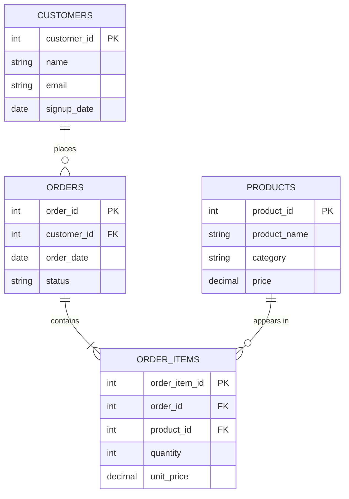

# 03 · Databases

*Part 3 of [The Complete Data Analyst & Data Science Roadmap](00_Table_of_Contents.md) · Previous: [02. How Companies Work](02_How_Companies_Work.md)*

> 💡 **What you'll be able to do after this chapter**
> Read and design a relational schema, explain normalization, and design a Star Schema — the skill that makes everything in [Chapter 04 (SQL)](04_SQL.md) click into place.

---

## 3.1 Relational databases, in one picture

A relational database stores data in **tables** (rows × columns), and tables relate to each other through **keys**.



### Primary Keys & Foreign Keys

- **Primary Key (PK):** the column (or set of columns) that uniquely identifies each row in a table. `customer_id` in `CUSTOMERS`.
- **Foreign Key (FK):** a column in one table that points to a Primary Key in another, creating a relationship. `customer_id` in `ORDERS` points back to `CUSTOMERS`.

> 🏢 **Real company example**
> At any e-commerce company, `orders.customer_id` is a foreign key into `customers.customer_id`. This is *how* the system knows which customer placed which order — and it's the exact relationship you'll `JOIN` on constantly in [Chapter 04](04_SQL.md).

### Indexes

An **index** is a lookup structure that lets the database find rows without scanning the entire table — the same idea as a book's index letting you skip straight to a page instead of reading cover to cover.

> ✅ **Best practice**
> Primary Keys are indexed automatically. As an analyst, the index decision that affects you most is: columns you constantly filter or join on (`WHERE customer_id = ...`, `JOIN ... ON order_id`) benefit from an index. You won't usually create indexes yourself, but you'll diagnose slow queries by asking "is this missing one?" — covered in [04.7 Performance & Optimization](04_SQL.md#47-performance-indexes--optimization).

---

## 3.2 Normalization

**Normalization** is the process of organizing tables to eliminate duplicate data and inconsistency.

| Form | Rule | Fixes |
|---|---|---|
| **1NF** | Every column holds a single value (no comma-separated lists in a cell) | Repeating groups in one field |
| **2NF** | 1NF + every non-key column depends on the *whole* primary key | Partial dependency in composite keys |
| **3NF** | 2NF + no non-key column depends on another non-key column | Transitive dependency (e.g., storing `city` and `country` when `city` already determines `country`) |

> ⚠️ **Common mistake**
> Storing `customer_name` on every single row of the `ORDERS` table instead of just `customer_id`. Now if a customer changes their name, you have to update it in a thousand places — and if you miss one, your data is now inconsistent. Normalization exists to prevent exactly this.

> 🏢 **Real company example**
> Operational databases (the OLTP systems behind the app) are almost always heavily normalized — it keeps writes fast and consistent. But the *warehouse* often intentionally **denormalizes** parts of that structure, because analysts value query simplicity and read speed over write efficiency. That trade-off is exactly what a Star Schema is for.

---

## 3.3 Star Schema vs. Snowflake Schema

Once data lands in the warehouse, it's typically remodeled around **Fact tables** and **Dimension tables**.

- **Fact table:** the "what happened" — one row per event/transaction, mostly numbers (measures) and foreign keys.
- **Dimension table:** the "who/what/where/when" — descriptive attributes you slice and filter by.

```mermaid
erDiagram
    FACT_SALES ||--o{ DIM_DATE : "occurred on"
    FACT_SALES ||--o{ DIM_CUSTOMER : "sold to"
    FACT_SALES ||--o{ DIM_PRODUCT : "of product"
    FACT_SALES ||--o{ DIM_STORE : "sold at"

    FACT_SALES {
        int sale_id PK
        int date_id FK
        int customer_id FK
        int product_id FK
        int store_id FK
        decimal revenue
        int quantity
    }
    DIM_DATE { int date_id PK, date full_date, int year, int month, string weekday }
    DIM_CUSTOMER { int customer_id PK, string name, string segment }
    DIM_PRODUCT { int product_id PK, string name, string category }
    DIM_STORE { int store_id PK, string city, string region }
```

This is a **Star Schema**: one central fact table surrounded directly by flat dimension tables. It's called that because the diagram looks like a star.

A **Snowflake Schema** takes it further by normalizing the dimensions themselves — e.g., splitting `DIM_PRODUCT` into `DIM_PRODUCT` → `DIM_CATEGORY` → `DIM_DEPARTMENT`.

| | Star Schema | Snowflake Schema |
|---|---|---|
| Dimensions | Denormalized (flat) | Normalized (split into sub-tables) |
| Query complexity | Simpler — fewer joins | More joins required |
| Query speed | Generally faster | Can be slower due to extra joins |
| Storage | Slightly more redundant | More storage-efficient |
| When companies choose it | Default choice for BI/reporting — favors analyst simplicity | Very large dimension tables, or strict data governance needs |

> ✅ **Best practice**
> As a Data Analyst, default to expecting a **Star Schema** in a well-built warehouse — it's what `Analytics Engineers` optimize for, because it's what makes Power BI and SQL fast and understandable. If you're handed a Snowflake Schema, expect more joins in your everyday queries.

---

## 3.4 OLTP vs. OLAP

| | OLTP (Online Transaction Processing) | OLAP (Online Analytical Processing) |
|---|---|---|
| Purpose | Run the business, transaction by transaction | Analyze the business, in aggregate |
| Example system | The app's production database | The Data Warehouse |
| Query pattern | Short, simple, high-frequency (`INSERT`, single-row `UPDATE`) | Long, complex, aggregating over millions of rows |
| Schema | Normalized | Star/Snowflake (partially denormalized) |
| Who touches it | The application itself | Analysts, Scientists, BI tools |

This is the same distinction from [02.2](02_How_Companies_Work.md#22-operational-database--data-warehouse) — now you know *why* the two systems are shaped so differently: OLTP is optimized for **normalized, fast writes**; OLAP is optimized for **denormalized, fast aggregate reads**.

---

## 3.5 SQL preview

You don't need full SQL fluency yet ([Chapter 04](04_SQL.md) is the complete course), but here's how the schema above turns into a real question:

```sql
-- "Total revenue by product category, last quarter"
SELECT
    p.category,
    SUM(f.revenue) AS total_revenue
FROM fact_sales f
JOIN dim_product p ON f.product_id = p.product_id
JOIN dim_date d ON f.date_id = d.date_id
WHERE d.full_date >= '2026-04-01' AND d.full_date < '2026-07-01'
GROUP BY p.category
ORDER BY total_revenue DESC;
```

Notice how directly this maps to the Star Schema: one `JOIN` per dimension you need, one `GROUP BY` for the level of detail you want. That's the entire point of designing it this way.

---

## Chapter Summary

- Relational databases connect tables through **Primary Keys** and **Foreign Keys**; **indexes** make lookups fast.
- **Normalization** (1NF–3NF) removes duplication and inconsistency — critical for OLTP systems.
- Warehouses remodel data into **Fact** and **Dimension** tables, typically as a **Star Schema** (simpler, faster) or a **Snowflake Schema** (more normalized, more joins).
- **OLTP** runs the business transaction-by-transaction; **OLAP** analyzes it in aggregate — different shapes for different jobs.

**Next:** [04. SQL →](04_SQL.md) — the complete SQL course, built directly on the schema concepts from this chapter.
