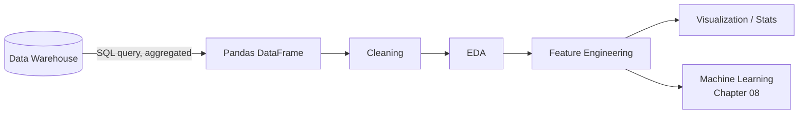

# 05 · Python

*Part 5 of [The Complete Data Analyst & Data Science Roadmap](00_Table_of_Contents.md) · Previous: [04. SQL](04_SQL.md)*

> 💡 **What you'll be able to do after this chapter**
> Take a SQL query result and do everything SQL is bad at: deep cleaning, exploratory analysis, feature engineering, and visualization — organized like a professional project, not a scratch notebook.

---

## 5.1 Where Python fits (and where it doesn't)

> 📌 **Callout**
> Don't pull millions of rows into Python to do what SQL already does well (aggregation, filtering, joining). Use SQL to get the warehouse to do the heavy lifting, then bring the *result* into Python for what SQL can't do well: statistical modeling, complex cleaning logic, and rich visualization.



## 5.2 Pandas & NumPy

```python
import pandas as pd
import numpy as np

df = pd.read_sql("SELECT * FROM vw_monthly_category_revenue", conn)
df.head()
df.info()
df.describe()
```

NumPy underlies Pandas — you'll use it directly for vectorized math and handling `NaN`:

```python
df['revenue_log'] = np.log1p(df['revenue'])
```

> 🏢 **Real company example**
> Analysts at companies like **Rappi** or **Amazon** rarely load raw multi-million-row tables into Pandas — they aggregate in SQL first (see [04.7](04_SQL.md#47-performance-indexes--optimization)), then bring a few thousand summarized rows into Python for the analysis SQL can't express.

## 5.3 Cleaning

```python
df = df.drop_duplicates()
df['email'] = df['email'].str.strip().str.lower()
df['signup_date'] = pd.to_datetime(df['signup_date'], errors='coerce')
df['revenue'] = df['revenue'].fillna(0)
```

> ⚠️ **Common mistake**
> Silently dropping rows with `dropna()` without checking *how much* data you're losing or *why* it's missing. Always check `df.isna().sum()` first and understand whether missingness is random or meaningful (e.g., "revenue is null" might mean "order was cancelled," not "data error").

## 5.4 Exploratory Data Analysis (EDA)

```python
df['category'].value_counts()
df.groupby('category')['revenue'].agg(['sum', 'mean', 'count'])
df.corr(numeric_only=True)
```

EDA answers: what does this data actually look like, are there outliers, are there surprises, does anything contradict what stakeholders assume?

## 5.5 Feature Engineering

```python
df['order_month'] = df['order_date'].dt.to_period('M')
df['is_weekend'] = df['order_date'].dt.dayofweek >= 5
df['revenue_per_unit'] = df['revenue'] / df['quantity']
```

Feature engineering is where domain knowledge from the business becomes a column a model or a chart can use directly — the bridge into [Chapter 08 (Machine Learning)](08_Machine_Learning.md).

## 5.6 Visualization & Statistics

```python
import matplotlib.pyplot as plt
import seaborn as sns

sns.lineplot(data=df, x='order_month', y='revenue', hue='category')
plt.title('Monthly Revenue by Category')
plt.show()
```

Pair every chart with the statistic that backs it up — a mean without a sense of spread (std dev, IQR) can mislead a stakeholder.

> ✅ **Best practice**
> Always ask "compared to what?" A number alone ("revenue was $2M last month") means nothing without a comparison — month-over-month, year-over-year, or against a target.

## 5.7 Project organization, logging, virtual environments

```
project/
├── data/
├── notebooks/
├── src/
│   ├── clean.py
│   ├── features.py
│   └── analysis.py
├── requirements.txt
├── .gitignore
└── README.md
```

```bash
python -m venv .venv
source .venv/bin/activate      # or .venv\Scripts\activate on Windows
pip install pandas numpy matplotlib seaborn
pip freeze > requirements.txt
```

```python
import logging
logging.basicConfig(level=logging.INFO)
logger = logging.getLogger(__name__)
logger.info(f"Loaded {len(df)} rows after cleaning")
```

> ✅ **Best practice**
> A **virtual environment** per project + a committed `requirements.txt` is what separates a "script that ran on my machine once" from a project a teammate can actually reproduce. This is exactly the habit you'll lean on for the [10 portfolio projects](../projects/).

---

## Chapter Summary

- Let SQL aggregate; let Python clean, explore, engineer features, and visualize.
- Always quantify missingness before dropping data, and always compare numbers to something.
- Structure every project with `venv` + `requirements.txt` + logging from day one — it's a five-minute habit that makes your work reproducible.

Exercises live in [`../exercises/05_Python/`](../exercises/05_Python/).

**Next:** [06. Power BI →](06_Power_BI.md) — turning this analysis into a dashboard stakeholders actually use.
