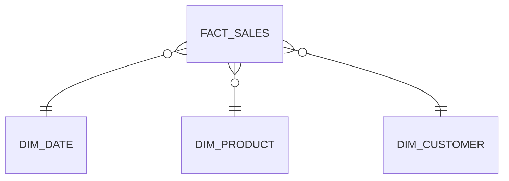
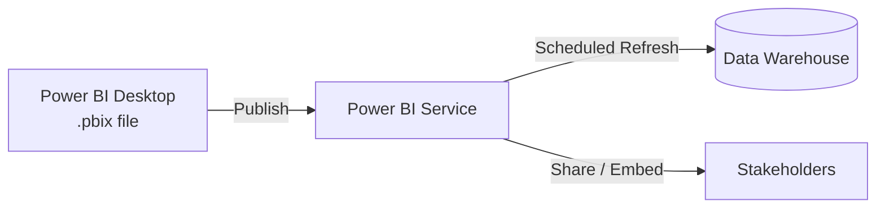

# 06 · Power BI

*Part 6 of [The Complete Data Analyst & Data Science Roadmap](00_Table_of_Contents.md) · Previous: [05. Python](05_Python.md)*

> 💡 **What you'll be able to do after this chapter**
> Build a real dashboard from zero: load and model data, write DAX measures, and publish something a Product Manager or exec would actually trust.

---

## 6.1 Power Query

Power Query is Power BI's data-loading and shaping layer (Get Data → Transform). Think of it as a GUI front-end for many of the cleaning steps you did in [Chapter 05](05_Python.md#53-cleaning), except here they compile into a reusable, refreshable pipeline.

> ✅ **Best practice**
> Do heavy transformation upstream (SQL/dbt in the warehouse) and keep Power Query for light shaping — renaming, type-casting, simple filters. A model that leans on the warehouse for logic is easier to debug and much faster to refresh.

## 6.2 Data Modeling & Relationships

Power BI wants your data modeled the same way you learned in [Chapter 03](03_Databases.md#33-star-schema-vs-snowflake-schema): a **Star Schema** with one fact table and several dimension tables, connected by one-to-many relationships.



> ⚠️ **Common mistake**
> Importing flat, wide, pre-joined tables from a spreadsheet instead of a proper star schema. It works for a tiny dataset, then breaks down fast — duplicated dimension rows, wrong aggregations, and DAX that's needlessly complicated. Model it right from the start.

## 6.3 DAX, Measures, KPIs

**DAX** (Data Analysis Expressions) is Power BI's formula language. The single most important habit: write **Measures**, not **Calculated Columns**, for anything you aggregate.

```dax
Total Revenue = SUM(fact_sales[revenue])

Revenue MoM % =
VAR CurrentMonth = [Total Revenue]
VAR PreviousMonth =
    CALCULATE([Total Revenue], DATEADD(dim_date[full_date], -1, MONTH))
RETURN
    DIVIDE(CurrentMonth - PreviousMonth, PreviousMonth)
```

| | Calculated Column | Measure |
|---|---|---|
| Computed | Row by row, stored in the model | On the fly, based on filter context |
| Use for | Static per-row attributes (e.g., `Full Name`) | KPIs, aggregations, anything that changes with filters |
| Cost | Increases model size | Computed at query time — no storage cost |

> 🏢 **Business case:** An exec filters the dashboard to "Region = LatAm, Q2." A well-written **Measure** for `Total Revenue` automatically recalculates for that filter context — a calculated column would not.

## 6.4 Dashboards, Bookmarks, Drill Through

- **Dashboard/report design:** lead with the KPI, support with trend, allow drill-down — don't bury the answer under five charts of context.
- **Bookmarks:** save a specific filter/view state, used to build guided "buttons" that switch report views.
- **Drill Through:** let a user right-click a data point (e.g., a region) and jump to a detail page filtered to just that region.

> ✅ **Best practice**
> Design for the "5-second read": someone glancing at your dashboard mid-meeting should get the headline number and its direction (up/down vs. target) without hunting.

## 6.5 Deployment, Publishing, Best Practices



> ✅ **Best practices checklist**
> - Set up **scheduled refresh** so the dashboard is never showing stale data.
> - Use **Row-Level Security (RLS)** if different regions/teams should only see their own data.
> - Document your measures (Power BI supports descriptions) so the next analyst doesn't reverse-engineer your DAX.
> - Version your `.pbix` files and keep a changelog for major dashboard redesigns, same discipline as [`../CHANGELOG.md`](../CHANGELOG.md) for this handbook.

---

## Chapter Summary

- Power Query shapes data lightly; heavy transformation belongs upstream in SQL.
- Model in a Star Schema — it's the same discipline from Chapter 03, now inside Power BI.
- Write **Measures**, not Calculated Columns, for KPIs — they respect filter context.
- Publish with scheduled refresh, RLS where needed, and documentation, so the dashboard survives without you in the room.

Exercises live in [`../exercises/06_Power_BI/`](../exercises/06_Power_BI/).

**Next:** [07. Professional Projects →](07_Professional_Projects.md) — combining SQL, Python, and Power BI into a complete, presentable project.
