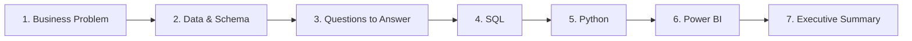

# 07 · Professional Projects

*Part 7 of [The Complete Data Analyst & Data Science Roadmap](00_Table_of_Contents.md) · Previous: [06. Power BI](06_Power_BI.md)*

> 💡 **What you'll be able to do after this chapter**
> Scope, structure, and deliver a project the way it actually happens inside a company — not a Kaggle notebook, but a business problem taken from question to executive summary.

---

## 7.1 The methodology

Every project in [`../projects/`](../projects/) follows the same seven-step arc — this is also, not coincidentally, how real analyst work gets scoped at a company:



1. **Business Problem** — one paragraph, written like a stakeholder actually asked it ("Why is churn rising in the Northeast?"), not like a dataset description.
2. **Database Diagram** — the schema you're working with, drawn like [Chapter 03](03_Databases.md).
3. **Questions to Answer** — 4–6 concrete questions the business problem breaks down into.
4. **SQL** — extraction and aggregation per [Chapter 04](04_SQL.md).
5. **Python** — cleaning, EDA, feature engineering per [Chapter 05](05_Python.md).
6. **Power BI** — the dashboard stakeholders will actually open, per [Chapter 06](06_Power_BI.md).
7. **Executive Summary** — one page: what you found, what you recommend, what you'd need to go further.

> ✅ **Best practice**
> Write the Executive Summary **first**, as a hypothesis, before touching data. It forces you to state what a good answer would even look like — then the analysis either confirms it, kills it, or complicates it. That's a much stronger project narrative than "I explored the data and found some things."

> ⚠️ **Common mistake**
> Leading a project with the tools ("I used Python and Power BI to analyze retail data") instead of the business problem. Recruiters and hiring managers skim dozens of these — the ones that read like a business case study, not a tools showcase, stand out.

## 7.2 Project folder structure

Every project in [`../projects/`](../projects/) uses this structure:

```
projects/<NN_Project_Name>/
├── README.md        # business problem, objectives, architecture, workflow, conclusions
├── data/
├── sql/
├── python/
├── powerbi/
├── diagrams/
└── presentation/
```

## 7.3 The 10 projects

| # | Project | Difficulty | Primary skills |
|---|---|---|---|
| 01 | Retail Sales Analytics | Beginner | SQL, Power BI |
| 02 | E-commerce Customer Churn | Intermediate | SQL, Python |
| 03 | Adventure Works BI | Intermediate | SQL, Power BI |
| 04 | Northwind Operations | Beginner | SQL |
| 05 | Credit Card Fraud Detection | Advanced | Python, ML |
| 06 | HR Attrition Analytics | Intermediate | SQL, Python, Power BI |
| 07 | Marketing Campaign Performance | Intermediate | SQL, Power BI |
| 08 | Financial Forecasting | Advanced | Python, Time Series |
| 09 | Product Recommendation Engine | Advanced | Python, ML |
| 10 | Capstone End-to-End Pipeline | Advanced | SQL, Python, Power BI, ML |

Each project's own `README.md` (in its folder under [`../projects/`](../projects/)) follows the 7-step structure from §7.1 in full.

---

## Chapter Summary

- A real project starts with a business problem stated the way a stakeholder would ask it, not a dataset description.
- Structure: Business Problem → Schema → Questions → SQL → Python → Power BI → Executive Summary.
- Write the Executive Summary as a hypothesis first — it sharpens the whole analysis.
- The 10 projects in [`../projects/`](../projects/) apply this methodology end to end, increasing in difficulty.

**Next:** [08. Machine Learning →](08_Machine_Learning.md) — for the projects (05, 08, 09, 10) that go beyond SQL/BI into predictive modeling.
