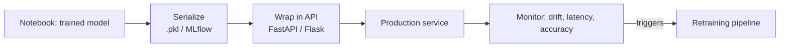

# 08 · Machine Learning

*Part 8 of [The Complete Data Analyst & Data Science Roadmap](00_Table_of_Contents.md) · Previous: [07. Professional Projects](07_Professional_Projects.md)*

> 💡 **What you'll be able to do after this chapter**
> Frame a business problem as a modeling problem, build a proper evaluation pipeline, and understand what it takes to get a model into production — the Data Analyst → Data Scientist bridge from [01.4](01_Introduction.md#14-career-paths).

---

## 8.1 The problem types

| Type | Predicts | Example |
|---|---|---|
| **Regression** | A continuous number | Forecast next month's revenue |
| **Classification** | A category | Will this customer churn? (yes/no) |
| **Clustering** | Ungrouped structure | Segment customers by behavior, no labels given |
| **Recommendation** | Ranked relevance | "Customers who bought X also bought Y" |
| **Time Series** | Future values over time | Daily demand forecasting |
| **NLP** | Structure/meaning from text | Classify support tickets by topic, sentiment of reviews |

> 🏢 **Real company example**
> A **Credit Card Fraud Detection** system (see [Project 05](../projects/05_Credit_Card_Fraud_Detection/)) is a classification problem with extreme class imbalance — fraud is maybe 0.1% of transactions. Framing this correctly (and choosing the right metric) matters more than which algorithm you pick.

## 8.2 Feature Engineering (recap + modeling lens)

Everything from [05.5](05_Python.md#55-feature-engineering) applies — now with a modeling goal: does this feature actually help the model separate classes / predict the number, or is it noise the model will overfit to?

```python
from sklearn.preprocessing import StandardScaler, OneHotEncoder
from sklearn.compose import ColumnTransformer

preprocess = ColumnTransformer([
    ('num', StandardScaler(), ['revenue_per_unit', 'order_count']),
    ('cat', OneHotEncoder(handle_unknown='ignore'), ['category', 'region']),
])
```

## 8.3 Pipelines & Cross-Validation

```python
from sklearn.pipeline import Pipeline
from sklearn.ensemble import RandomForestClassifier
from sklearn.model_selection import cross_val_score, train_test_split

X_train, X_test, y_train, y_test = train_test_split(X, y, test_size=0.2, stratify=y, random_state=42)

pipe = Pipeline([
    ('preprocess', preprocess),
    ('model', RandomForestClassifier(random_state=42)),
])

scores = cross_val_score(pipe, X_train, y_train, cv=5, scoring='f1')
pipe.fit(X_train, y_train)
```

> ✅ **Best practice**
> Always wrap preprocessing + model in a single `Pipeline`, and always cross-validate. A model that looks great on one train/test split and terrible on another isn't ready — this is the #1 way junior projects overstate results.

## 8.4 Model Evaluation

| Metric | Use when |
|---|---|
| **RMSE / MAE** | Regression — average error magnitude |
| **Accuracy** | Classification, only when classes are balanced |
| **Precision / Recall / F1** | Classification with imbalance (fraud, churn) |
| **ROC-AUC** | Ranking how well the model separates classes across thresholds |

> ⚠️ **Common mistake**
> Reporting 99% accuracy on a fraud model where fraud is 0.1% of the data — a model that predicts "not fraud" for everything gets 99.9% accuracy while being completely useless. This is exactly why **Precision/Recall** exist.

## 8.5 Hyperparameter Optimization

```python
from sklearn.model_selection import GridSearchCV

param_grid = {'model__n_estimators': [100, 300], 'model__max_depth': [5, 10, None]}
grid = GridSearchCV(pipe, param_grid, cv=5, scoring='f1')
grid.fit(X_train, y_train)
print(grid.best_params_)
```

## 8.6 Deployment (the ML Engineer handoff)



> 🏢 **Real company example**
> A Data Scientist's churn model doesn't create business value sitting in a notebook. An **ML Engineer** wraps it behind an API, the product calls it when deciding who gets a retention offer, and the model is monitored for **drift** — when live data starts looking different from training data, accuracy silently degrades. This is the role boundary from [01.2](01_Introduction.md#12-the-six-roles-and-how-they-actually-differ).

---

## Chapter Summary

- Correctly frame the business problem as regression / classification / clustering / recsys / time series / NLP before picking an algorithm.
- Always use a `Pipeline` + cross-validation — never trust a single train/test split.
- Match the metric to the problem: imbalanced classification needs Precision/Recall/F1, not accuracy.
- Deployment is a distinct discipline (ML Engineering) — training a good model is necessary but not sufficient.

Exercises live in [`../exercises/08_Machine_Learning/`](../exercises/08_Machine_Learning/). Applied end-to-end in [Projects 05, 08, 09, 10](../projects/).

**Next:** [09. Portfolio & Career →](09_Portfolio_Career.md) — turning everything you've built into a job.
