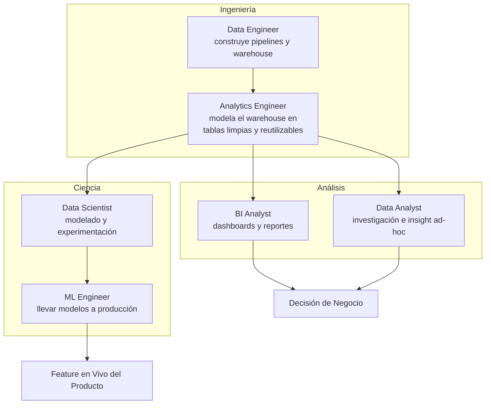
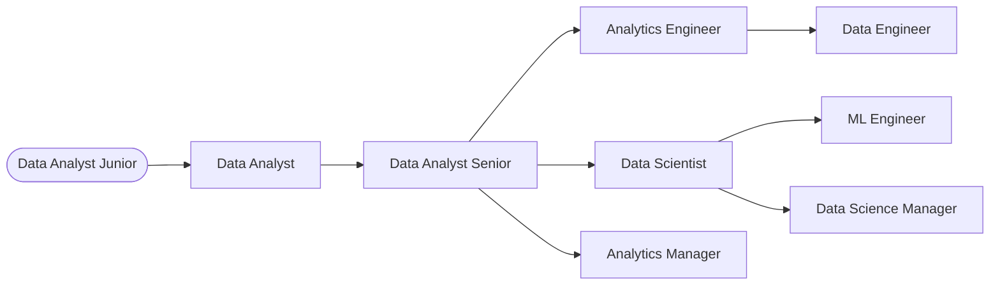

# 01 · Introducción

*Parte 1 de El Roadmap Completo del Analista de Datos y Data Science · Siguiente: [02. Cómo Trabajan las Empresas](02_Como_Trabajan_las_Empresas.md)*

> 💡 **Qué vas a poder hacer después de este capítulo**
> Explicar, en una entrevista o a alguien no técnico, exactamente qué hace diferente un Data Analyst de un Data Scientist, un Data Engineer y un Analytics Engineer — y elegir cuál de esos caminos de carrera perseguir, con una idea realista de habilidades, salario y trabajo diario.

---

## 1.1 ¿Qué es el dato?

Olvidate de la definición de manual por un segundo. Adentro de una empresa, **el dato es un escape**. Cada acción que hace un usuario, cada sistema que corre, cada transacción que se cierra — deja un rastro. Un click, un pago, un escaneo de entrega, un ticket de soporte, una lectura de sensor.

Nadie se propone "recolectar datos". El dato es un *subproducto* de que el negocio esté funcionando. Tu trabajo, en cada rol que cubre este handbook, es tomar ese subproducto y convertirlo en algo sobre lo que la empresa pueda actuar.


> 🏢 **Ejemplo real de empresa**
> En **Spotify**, reproducir una canción, saltarla a los 4 segundos, o agregarla a una playlist son todos eventos. Ninguno se generó "para analytics" — es simplemente lo que hace la app cuando la usás. El trabajo del equipo de Data empieza recién *después* de que ese evento ya existe.

El dato solo no vale nada. Se vuelve valioso en el momento en que alguien lo convierte en una decisión — esa transformación, de evento crudo a decisión, es lo que enseña todo este handbook, capa por capa:

```
Usuarios → Aplicaciones → Base de Datos Operacional → ETL/ELT → Data Warehouse
      → SQL → Python → Power BI → Decisión de Negocio → Machine Learning → Deployment
```

Vas a ver este mismo pipeline de nuevo en el [Capítulo 02](02_Como_Trabajan_las_Empresas.md), donde cada flecha tiene su propio análisis en profundidad.

---

## 1.2 Los seis roles, y cómo se diferencian realmente

Los títulos de puesto en el mundo del dato son inconsistentes entre empresas — un "Data Analyst" en una empresa hace lo que un "Data Scientist" hace en otra. Pero el *trabajo en sí* se agrupa en seis trabajos reconocibles. Así se distinguen por lo que realmente hacen en su día a día, no por su título.

| Rol | Pregunta central que responde | Herramientas principales | Output |
|---|---|---|---|
| **BI Analyst** | "¿Qué pasó, y cómo lo hago visible para todos?" | SQL, Power BI / Tableau | Dashboards, reportes recurrentes |
| **Data Analyst** | "¿Por qué pasó, y qué deberíamos hacer?" | SQL, Excel, Python, Power BI | Análisis ad-hoc, insights, presentaciones |
| **Data Scientist** | "¿Qué va a pasar, y qué tan seguros estamos?" | Python, estadística, ML | Modelos, experimentos, predicciones |
| **Data Engineer** | "¿Cómo movemos y almacenamos datos de forma confiable a escala?" | SQL, Python, Spark, Airflow, cloud | Pipelines, warehouses |
| **Analytics Engineer** | "¿Cómo hacemos modelos de datos limpios y confiables que todos puedan consultar?" | SQL, dbt, herramientas de warehouse | Modelos de datos, capa de transformación |
| **ML Engineer** | "¿Cómo logramos que un modelo funcione de forma confiable en producción?" | Python, APIs, Docker, cloud, MLOps | Modelos desplegados y monitoreados |

> 📌 **Recuadro — la forma más rápida de distinguir dos roles**
> Preguntate: *"¿Qué entregan, y a quién?"*
> - Un **BI Analyst** le entrega un dashboard a un ejecutivo.
> - Un **Data Analyst** le entrega un insight a quien toma la decisión.
> - Un **Data Scientist** le entrega un modelo o una hipótesis testeada a un Data Analyst o a un equipo de producto.
> - Un **Data Engineer** le entrega tablas limpias y confiables a todos los de arriba.
> - Un **Analytics Engineer** le entrega modelos de datos *confiables y documentados* (no tablas crudas) a Analysts y Scientists.
> - Un **ML Engineer** le entrega un servicio corriendo y monitoreado al producto mismo.

### Cómo se ve esto dentro de una empresa real



> 🏢 **Ejemplo real de empresa**
> En **Mercado Libre**, cuando un Product Manager pregunta "¿por qué sube el abandono de carrito en Brasil?", un **Data Analyst** lo responde con SQL y una presentación en días. Si la respuesta se convierte en "deberíamos construir un modelo que prediga quién está por abandonar su carrito," eso se vuelve un proyecto de **Data Scientist** — y si sale a producción como un disparador de descuento en vivo en la app, un **ML Engineer** lo pone en producción y lo mantiene funcionando.

---

## 1.3 Responsabilidades diarias, rol por rol

### BI Analyst
- Mantener y extender dashboards recurrentes (revenue, retención, métricas operativas)
- Ser dueño de las definiciones de métricas para que "revenue" signifique lo mismo para todos
- Atender tickets de "el dashboard se ve mal"
- Presentar revisiones de negocio semanales/mensuales

### Data Analyst
- Que lo metan en un hilo de Slack con una pregunta vaga ("¿estamos perdiendo plata con esta promo?") y convertirla en un análisis acotado
- Escribir SQL contra el warehouse, verificar los números, visualizarlos
- Presentar hallazgos con una recomendación clara, no solo un gráfico
- Trabajar directamente con stakeholders de Producto/Marketing/Finanzas

### Data Scientist
- Enmarcar un problema de negocio como un problema de modelado (clasificación, regresión, ranking, etc.)
- Explorar datos, crear features, entrenar y validar modelos
- Diseñar y leer resultados de tests A/B
- Comunicar incertidumbre y trade-offs a stakeholders no técnicos

### Data Engineer
- Construir y mantener pipelines de ETL/ELT
- Diseñar esquemas de warehouse para confiabilidad y performance de queries
- Ser dueño de chequeos de calidad de datos, alertas y SLAs de pipelines
- Gestionar infraestructura cloud y sus costos

### Analytics Engineer
- Escribir y testear lógica de transformación (comúnmente en dbt) sobre datos crudos del warehouse
- Documentar tablas y columnas para que el analytics self-serve realmente funcione
- Ser dueño de la capa de "única fuente de verdad" entre el dato crudo y todos los que consultan
- Ser puente entre Data Engineering y Análisis

### ML Engineer
- Tomar el notebook de un Data Scientist y convertirlo en un servicio confiable
- Construir pipelines de entrenamiento/inferencia, APIs, monitoreo y triggers de reentrenamiento
- Gestionar versionado de modelos y rollback
- Ser dueño de latencia, costo y uptime del ML en producción

---

## 1.4 Caminos de carrera

Ninguno de estos roles es un callejón sin salida — son un grafo, no una escalera. El punto de entrada más común para la audiencia de este handbook es **Data Analyst**, y los dos caminos dominantes desde ahí son:



> ✅ **Buena práctica**
> No intentes elegir tu destino final el primer día. Empezá como Data Analyst, volvete fluido en SQL y contexto de negocio, y dejá que el trabajo mismo te diga si disfrutás más el lado de "construir sistemas confiables" (→ Analytics/Data Engineering) o el lado de "modelar incertidumbre" (→ Data Science).

> ⚠️ **Error común**
> Saltar directo a tutoriales de Machine Learning sin haber consultado nunca una base de datos de producción real, sucia y sin documentar. Las empresas no contratan ML Engineers que no puedan manejar datos sucios — contratan Analysts que crecieron hacia eso. Los [Capítulos 03–05](03_Bases_de_Datos.md) asumen que pasaste por ahí antes exactamente por esta razón.

---

## 1.5 Rangos salariales (referencias orientativas)

Los salarios varían enormemente según país, tamaño de empresa y seniority — tratá esto como **orientativo**, no contractual.

| Rol | LatAm (remoto, USD/año) | EE.UU. (presencial/remoto, USD/año) | UE (presencial/remoto, EUR/año) |
|---|---|---|---|
| BI Analyst | $18k – $40k | $65k – $100k | €35k – €60k |
| Data Analyst | $20k – $45k | $70k – $110k | €38k – €65k |
| Data Analyst Senior | $35k – $65k | $100k – $140k | €55k – €85k |
| Data Scientist | $30k – $60k | $110k – $165k | €55k – €95k |
| Data Engineer | $30k – $65k | $115k – $170k | €55k – €95k |
| Analytics Engineer | $30k – $60k | $110k – $155k | €55k – €90k |
| ML Engineer | $35k – $75k | $130k – $190k | €65k – €110k |

> 📌 **Recuadro**
> La compensación total (equity, bonos) en grandes empresas de tecnología (Google, Amazon, Microsoft, Stripe) puede llevar el extremo superior del rango de EE.UU. entre 30–60% más alto. Los rangos de LatAm de arriba asumen **trabajo remoto para una empresa extranjera** — los salarios solo-mercado-local son típicamente 40–60% más bajos.

---

## 1.6 Matriz de habilidades requeridas

| Habilidad | BI Analyst | Data Analyst | Data Scientist | Data Engineer | Analytics Engineer | ML Engineer |
|---|:---:|:---:|:---:|:---:|:---:|:---:|
| SQL | ●●● | ●●● | ●●○ | ●●● | ●●● | ●●○ |
| Excel / Planillas | ●●● | ●●● | ●○○ | ●○○ | ●○○ | ○○○ |
| Python | ●○○ | ●●○ | ●●● | ●●● | ●●○ | ●●● |
| Estadística | ●○○ | ●●○ | ●●● | ●○○ | ●○○ | ●●○ |
| Visualización de datos (Power BI/Tableau) | ●●● | ●●● | ●○○ | ○○○ | ●○○ | ○○○ |
| Modelado de Datos / Warehousing | ●●○ | ●●○ | ●○○ | ●●● | ●●● | ●○○ |
| Machine Learning | ○○○ | ●○○ | ●●● | ○○○ | ○○○ | ●●● |
| Ingeniería de Software / APIs | ○○○ | ○○○ | ●○○ | ●●● | ●●○ | ●●● |
| Comunicación de negocio | ●●● | ●●● | ●●○ | ●○○ | ●●○ | ●○○ |
| Plataformas Cloud (AWS/Azure/GCP) | ●○○ | ●○○ | ●●○ | ●●● | ●●○ | ●●● |

`●●●` central al rol · `●●○` importante · `●○○` útil · `○○○` rara vez necesaria

Este handbook construye estas habilidades en el orden que realmente necesitan las empresas: **Bases de Datos → SQL → Python → Power BI → Proyectos → Machine Learning → Portfolio**, siguiendo el pipeline del §1.1.

---

## 1.7 Libros recomendados

| Libro | Autor | Mejor para |
|---|---|---|
| *SQL for Data Analysis* | Cathy Tanimura | Fundamentos de SQL con patrones analíticos reales |
| *Storytelling with Data* | Cole Nussbaumer Knaflic | Convertir gráficos en decisiones sobre las que la gente actúa |
| *Python for Data Analysis* | Wes McKinney (creador de Pandas) | La referencia definitiva de Pandas |
| *The Data Warehouse Toolkit* | Ralph Kimball | Star schema, modelado dimensional — fundamental para el Cap. 03 |
| *Practical Statistics for Data Scientists* | Peter Bruce, Andrew Bruce, Peter Gedeck | Estadística con mirada de practicante, no de profesor |
| *Designing Data-Intensive Applications* | Martin Kleppmann | Para cuando quieras entender qué construyen realmente los Data Engineers |
| *Hands-On Machine Learning with Scikit-Learn, Keras & TensorFlow* | Aurélien Géron | La referencia práctica estándar de ML |

## 1.8 Canales de YouTube recomendados

| Canal | Enfoque |
|---|---|
| **Luke Barousse** | Consejos de carrera para Data Analyst, insight real del mercado laboral |
| **Alex The Analyst** | SQL, Power BI y fundamentos de Data Analyst desde cero |
| **StatQuest with Josh Starmer** | Conceptos de estadística y ML explicados visualmente, sin relleno |
| **Seattle Data Guy** | Data Engineering y estrategia de carrera desde un practicante de la industria |
| **Ken Jee** | Caminos de carrera en Data Science y construcción de portfolio |
| **Corey Schafer** | Fundamentos de Python profundos y correctos |
| **Guy in a Cube** | Power BI directo de un ex miembro del equipo de Power BI de Microsoft |

---

## Resumen del capítulo

- El dato no tiene valor hasta que se convierte en una decisión — esa transformación es el trabajo, en cada rol de este campo.
- BI Analyst, Data Analyst, Data Scientist, Data Engineer, Analytics Engineer y ML Engineer son seis trabajos distintos que se distinguen por *qué entregan y a quién*, no solo por el título.
- La mayoría de las personas que entran a este campo deberían empezar como **Data Analyst** y ramificarse hacia Data Science o Analytics/Data Engineering según qué parte del trabajo disfruten.
- Las habilidades se acumulan en un orden específico — este handbook sigue ese orden empezando en el [Capítulo 02](02_Como_Trabajan_las_Empresas.md).

**Siguiente:** [02. Cómo Trabajan las Empresas →](02_Como_Trabajan_las_Empresas.md) — cómo se genera y almacena realmente el dato antes de que alguien lo pueda analizar.
