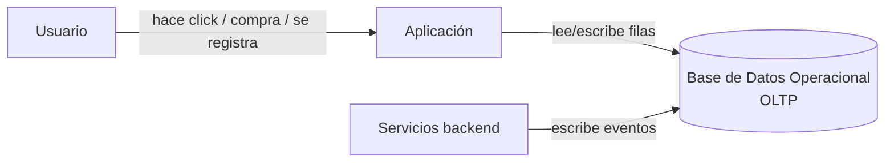
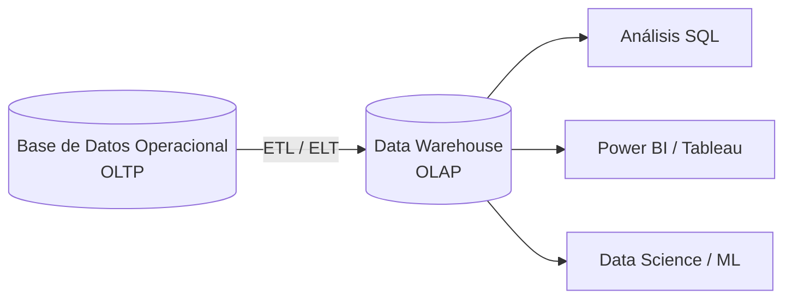
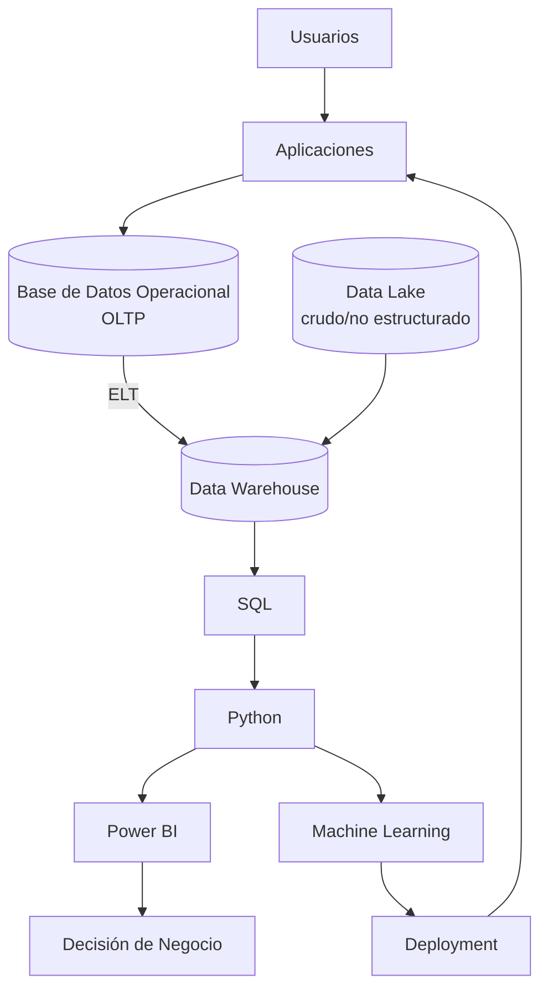

# 02 · Cómo Trabajan las Empresas

*Parte 2 · Anterior: [01. Introducción](01_Introduccion.md)*

> 💡 **Qué vas a poder hacer después de este capítulo**
> Dibujar y explicar la arquitectura de datos real de una empresa moderna — desde que un usuario toca un botón hasta que un ejecutivo ve un número en un dashboard — y saber cuándo una empresa recurre a un Data Warehouse vs. un Data Lake vs. un Lakehouse, y batch vs. streaming.

---

## 2.1 Cómo se genera el dato

Toda empresa corre sobre **aplicaciones** — la app móvil, el sitio web, el sistema de punto de venta, la herramienta interna de administración. Esas aplicaciones necesitan recordar cosas *ahora mismo*: si el pago se acreditó, si el ítem sigue en stock, si el usuario está logueado. Esa memoria inmediata y transaccional vive en una **base de datos operacional** (también llamada OLTP — ver [Capítulo 03](03_Bases_de_Datos.md)).

> 🏢 **Ejemplo real de empresa**
> Cuando agregás un ítem al carrito en **Mercado Libre**, esa escritura va directo a una base de datos operacional optimizada para *velocidad y consistencia de una sola transacción* — no para responder "¿cuáles fueron nuestras 10 categorías top el mes pasado?". Esa pregunta necesita un sistema completamente distinto, que es de lo que trata el resto de este capítulo.

---

## 2.2 Base de Datos Operacional → Data Warehouse

Las bases de datos operacionales están construidas para manejar miles de transacciones pequeñas y rápidas de lectura/escritura. Son **malas** para responder grandes preguntas analíticas ("revenue total por región, por mes, en los últimos 3 años") porque ese tipo de query escanea enormes cantidades de datos — y correr eso contra la base de datos en vivo ralentizaría la app para usuarios reales.

Entonces las empresas copian el dato hacia un segundo sistema, construido específicamente para análisis: el **Data Warehouse**.

El proceso que mueve y remodela el dato entre estos dos sistemas se llama **ETL** o **ELT**:

| | ETL (Extract, Transform, Load) | ELT (Extract, Load, Transform) |
|---|---|---|
| Orden | Transforma *antes* de cargar | Transforma *después* de cargar |
| Dónde ocurre la transformación | Un motor de procesamiento separado | Dentro del warehouse mismo |
| Común hoy porque | Los warehouses ahora son lo suficientemente potentes para transformar datos a escala | Los warehouses en la nube (Snowflake, BigQuery, Redshift) son baratos para correr grandes transformaciones |
| Herramientas típicas | Informatica, SSIS legacy, scripts a medida | Airbyte/Fivetran (extract+load) + dbt (transform) |

> ✅ **Buena práctica**
> Las empresas modernas cloud-first por defecto usan **ELT**: aterrizar el dato crudo en el warehouse primero, y después transformarlo con SQL/dbt donde es fácil de testear, versionar y volver a correr. Esta también es la capa donde viven los **Analytics Engineers** (ver [01.2](01_Introduccion.md#12-los-seis-roles-y-cómo-se-diferencian-realmente)).

> ⚠️ **Error común**
> Consultar directamente la base de datos operacional (de producción) para analytics. Así es como los analistas junior sin querer ralentizan — o tumban — la app en vivo. Analizá siempre desde el warehouse o una réplica de lectura, nunca desde la base de datos de producción primaria.

---

## 2.3 Data Warehouse vs. Data Lake vs. Lakehouse

| | Data Warehouse | Data Lake | Lakehouse |
|---|---|---|---|
| Forma del dato | Estructurado (tablas, filas, columnas) | Cualquier forma — estructurado, semi-estructurado, archivos crudos, imágenes, logs | Estructurado + no estructurado, unificado |
| Esquema | Forzado al escribir (schema-on-write) | Forzado al leer (schema-on-read) | Ambos, según la capa |
| Mejor para | Dashboards de BI, analytics SQL | Datos de entrenamiento de ML, logs crudos, exploración de data science | Todo — una sola plataforma para ambos |
| Ejemplos | Snowflake, BigQuery, Redshift | S3 + Hive/Glue, Azure Data Lake | Databricks, Snowflake (Iceberg), BigQuery (unificado) |

> 🏢 **Ejemplo real de empresa**
> Una empresa como **Netflix** vuelca logs crudos de eventos de visualización en un **Data Lake** porque el volumen y la variedad son enormes y no todos los equipos lo necesitan estructurado. El equipo de BI después construye una capa curada y estructurada encima — ya sea un **Data Warehouse** clásico o, cada vez más, un **Lakehouse** que permite que tanto analistas SQL como equipos de ML trabajen sobre el mismo almacenamiento subyacente sin duplicar datos.

---

## 2.4 Batch vs. Streaming

| | Procesamiento Batch | Streaming |
|---|---|---|
| El dato se mueve | Según un cronograma (cada hora, cada noche) | Continuamente, a medida que ocurren los eventos |
| Latencia | Minutos a horas | Milisegundos a segundos |
| Herramientas típicas | Airflow + jobs SQL/dbt, scripts de Python programados | Kafka, Kinesis, Flink, Spark Streaming |
| Caso de uso típico | Dashboard diario de revenue, reportes mensuales | Detección de fraude, recomendaciones en tiempo real, inventario en vivo |

> 📌 **Recuadro**
> La mayoría del trabajo de **Data Analyst** ocurre sobre datos procesados en **batch** — un dashboard que se refresca cada mañana es completamente normal y esperado. Streaming es más una preocupación de Data/ML Engineering, algo que vas a encontrar pero rara vez vas a construir vos mismo como analista.

---

## 2.5 Plataformas cloud: AWS, Azure, Google Cloud

No necesitás dominar ningún proveedor cloud para empezar como Data Analyst, pero vas a escuchar constantemente estos nombres — sabé para qué son.

| Proveedor | Warehouse | Almacenamiento (Lake) | Herramienta de BI | Notas |
|---|---|---|---|---|
| **AWS** | Redshift | S3 | QuickSight (poco común) | El cloud más común en general; a menudo combinado con Power BI o Tableau |
| **Azure** | Synapse Analytics | Azure Data Lake Storage | **Power BI** (nativo) | Común en empresas que ya usan el stack de Microsoft |
| **Google Cloud** | **BigQuery** | Cloud Storage | Looker / Looker Studio | Popular en empresas tech nativas de alto crecimiento |

> ✅ **Buena práctica**
> Cuando veas un aviso de trabajo que dice "SQL + BigQuery" o "SQL + Snowflake," no te asustes — el SQL que aprendés en el [Capítulo 04](04_SQL.md) es 90% transferible. Las diferencias son mayormente sintaxis de dialecto y cómo te conectás, no cómo pensás las queries.

---

## 2.6 El panorama completo

Este es el diagrama que hay que tener en la cabeza para el resto del handbook — cada capítulo restante cae en un nodo de este: [Bases de Datos](03_Bases_de_Datos.md) y [SQL](04_SQL.md) viven en la capa del warehouse, [Python](05_Python.md) y [Power BI](06_Power_BI.md) se apoyan encima, y [Machine Learning](08_Machine_Learning.md) cierra el loop de vuelta al producto.

---

## Resumen del capítulo

- Las aplicaciones escriben en **bases de datos operacionales** rápidas y transaccionales — nunca analices directamente contra ellas.
- **ETL/ELT** mueve y remodela ese dato hacia un **Data Warehouse** construido para análisis; las empresas modernas favorecen ELT con SQL/dbt.
- Los **Data Lakes** guardan datos crudos/no estructurados a escala; los **Lakehouses** intentan unificar ambos mundos.
- La mayoría del trabajo de analista corre sobre datos **batch**; **streaming** es más una preocupación de Data/ML Engineering.
- AWS, Azure y GCP ofrecen cada uno un warehouse, un lake y (en el caso de Azure) una herramienta de BI nativa — las habilidades de SQL que vas a construir en el Capítulo 04 se transfieren a todos ellos.

**Siguiente:** [03. Bases de Datos →](03_Bases_de_Datos.md) — qué hay realmente dentro de esa caja de warehouse, y cómo está estructurada para que SQL sea rápido.
