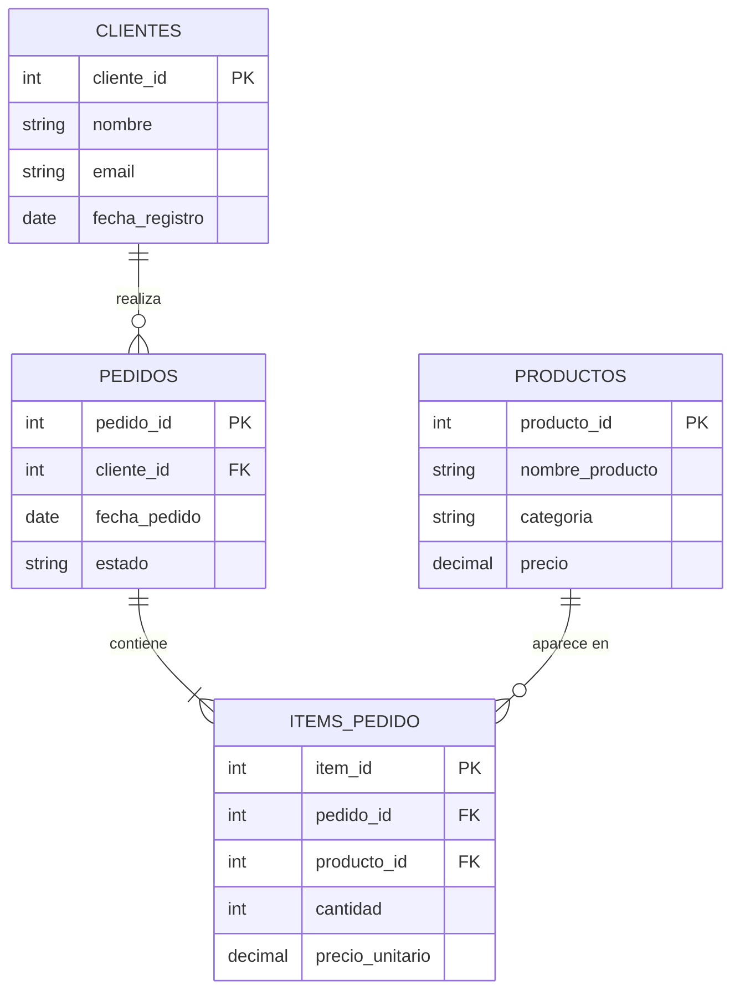

# 03 · Bases de Datos

*Parte 3 · Anterior: [02. Cómo Trabajan las Empresas](02_Como_Trabajan_las_Empresas.md)*

> 💡 **Qué vas a poder hacer después de este capítulo**
> Leer y diseñar un esquema relacional, explicar la normalización, y diseñar un Star Schema — la habilidad que hace que todo en el [Capítulo 04 (SQL)](04_SQL.md) encaje.

---

## 3.1 Bases de datos relacionales, en una imagen

Una base de datos relacional guarda el dato en **tablas** (filas × columnas), y las tablas se relacionan entre sí a través de **claves**.



### Claves Primarias y Claves Foráneas

- **Clave Primaria (PK):** la columna (o conjunto de columnas) que identifica de forma única cada fila de una tabla. `cliente_id` en `CLIENTES`.
- **Clave Foránea (FK):** una columna en una tabla que apunta a una Clave Primaria en otra, creando una relación. `cliente_id` en `PEDIDOS` apunta de vuelta a `CLIENTES`.

> 🏢 **Ejemplo real de empresa**
> En cualquier empresa de e-commerce, `pedidos.cliente_id` es una clave foránea hacia `clientes.cliente_id`. Así es *cómo* el sistema sabe qué cliente hizo qué pedido — y es exactamente la relación sobre la que vas a hacer `JOIN` constantemente en el [Capítulo 04](04_SQL.md).

### Índices

Un **índice** es una estructura de búsqueda que le permite a la base de datos encontrar filas sin escanear la tabla entera — la misma idea que el índice de un libro te permite saltar directo a una página en vez de leer de tapa a tapa.

> ✅ **Buena práctica**
> Las Claves Primarias se indexan automáticamente. Como analista, la decisión de índices que más te afecta es: las columnas que constantemente filtrás o usás para hacer join (`WHERE cliente_id = ...`, `JOIN ... ON pedido_id`) se benefician de un índice. Normalmente no vas a crear índices vos mismo, pero vas a diagnosticar queries lentas preguntándote "¿le falta uno a esto?" — cubierto en [04.7 Performance y Optimización](04_SQL.md#47-performance-índices-y-optimización).

---

## 3.2 Normalización

La **normalización** es el proceso de organizar tablas para eliminar datos duplicados e inconsistencias.

| Forma | Regla | Soluciona |
|---|---|---|
| **1FN** | Cada columna contiene un solo valor (sin listas separadas por comas en una celda) | Grupos repetidos en un campo |
| **2FN** | 1FN + cada columna no-clave depende de la *totalidad* de la clave primaria | Dependencia parcial en claves compuestas |
| **3FN** | 2FN + ninguna columna no-clave depende de otra columna no-clave | Dependencia transitiva (ej: guardar `ciudad` y `país` cuando `ciudad` ya determina `país`) |

> ⚠️ **Error común**
> Guardar `nombre_cliente` en cada fila de la tabla `PEDIDOS` en vez de solo `cliente_id`. Ahora, si un cliente cambia su nombre, tenés que actualizarlo en mil lugares — y si te olvidás de uno, tu dato ahora es inconsistente. La normalización existe exactamente para prevenir esto.

> 🏢 **Ejemplo real de empresa**
> Las bases de datos operacionales (los sistemas OLTP detrás de la app) casi siempre están fuertemente normalizadas — eso mantiene las escrituras rápidas y consistentes. Pero el *warehouse* a menudo **desnormaliza** intencionalmente partes de esa estructura, porque los analistas valoran la simplicidad de las queries y la velocidad de lectura por encima de la eficiencia de escritura. Ese trade-off es exactamente para lo que sirve un Star Schema.

---

## 3.3 Star Schema vs. Snowflake Schema

Una vez que el dato llega al warehouse, típicamente se remodela alrededor de tablas de **Hechos (Fact)** y **Dimensiones (Dimension)**.

- **Tabla de hechos (Fact table):** el "qué pasó" — una fila por evento/transacción, mayormente números (medidas) y claves foráneas.
- **Tabla de dimensión (Dimension table):** el "quién/qué/dónde/cuándo" — atributos descriptivos por los que segmentás y filtrás.

```mermaid
erDiagram
    FACT_VENTAS ||--o{ DIM_FECHA : "ocurrió en"
    FACT_VENTAS ||--o{ DIM_CLIENTE : "vendido a"
    FACT_VENTAS ||--o{ DIM_PRODUCTO : "de producto"
    FACT_VENTAS ||--o{ DIM_TIENDA : "vendido en"

    FACT_VENTAS {
        int venta_id PK
        int fecha_id FK
        int cliente_id FK
        int producto_id FK
        int tienda_id FK
        decimal revenue
        int cantidad
    }
    DIM_FECHA { int fecha_id PK, date fecha_completa, int anio, int mes, string dia_semana }
    DIM_CLIENTE { int cliente_id PK, string nombre, string segmento }
    DIM_PRODUCTO { int producto_id PK, string nombre, string categoria }
    DIM_TIENDA { int tienda_id PK, string ciudad, string region }
```

Esto es un **Star Schema**: una tabla de hechos central rodeada directamente por tablas de dimensión planas. Se llama así porque el diagrama parece una estrella.

Un **Snowflake Schema** lleva esto más lejos normalizando las dimensiones mismas — ej: dividiendo `DIM_PRODUCTO` en `DIM_PRODUCTO` → `DIM_CATEGORIA` → `DIM_DEPARTAMENTO`.

| | Star Schema | Snowflake Schema |
|---|---|---|
| Dimensiones | Desnormalizadas (planas) | Normalizadas (divididas en subtablas) |
| Complejidad de queries | Más simple — menos joins | Requiere más joins |
| Velocidad de queries | Generalmente más rápida | Puede ser más lenta por los joins extra |
| Almacenamiento | Levemente más redundante | Más eficiente en almacenamiento |
| Cuándo lo eligen las empresas | Opción por defecto para BI/reportes — favorece la simplicidad del analista | Dimensiones muy grandes, o necesidades estrictas de gobierno de datos |

> ✅ **Buena práctica**
> Como Data Analyst, esperá por defecto un **Star Schema** en un warehouse bien construido — es lo que los `Analytics Engineers` optimizan, porque es lo que hace rápido y entendible tanto a Power BI como a SQL. Si te dan un Snowflake Schema, esperá más joins en tus queries del día a día.

---

## 3.4 OLTP vs. OLAP

| | OLTP (Online Transaction Processing) | OLAP (Online Analytical Processing) |
|---|---|---|
| Propósito | Hacer funcionar el negocio, transacción por transacción | Analizar el negocio, de forma agregada |
| Sistema ejemplo | La base de datos de producción de la app | El Data Warehouse |
| Patrón de query | Corto, simple, alta frecuencia (`INSERT`, `UPDATE` de una fila) | Largo, complejo, agregando sobre millones de filas |
| Esquema | Normalizado | Star/Snowflake (parcialmente desnormalizado) |
| Quién lo toca | La aplicación misma | Analysts, Scientists, herramientas de BI |

Esta es la misma distinción del [02.2](02_Como_Trabajan_las_Empresas.md#22-base-de-datos-operacional--data-warehouse) — ahora sabés *por qué* los dos sistemas tienen formas tan distintas: OLTP está optimizado para **escrituras normalizadas y rápidas**; OLAP está optimizado para **lecturas agregadas y desnormalizadas, rápidas**.

---

## 3.5 Adelanto de SQL

No necesitás fluidez completa en SQL todavía (el [Capítulo 04](04_SQL.md) es el curso completo), pero así es como el esquema de arriba se convierte en una pregunta real:

```sql
-- "Revenue total por categoría de producto, último trimestre"
SELECT
    p.categoria,
    SUM(f.revenue) AS revenue_total
FROM fact_ventas f
JOIN dim_producto p ON f.producto_id = p.producto_id
JOIN dim_fecha d ON f.fecha_id = d.fecha_id
WHERE d.fecha_completa >= '2026-04-01' AND d.fecha_completa < '2026-07-01'
GROUP BY p.categoria
ORDER BY revenue_total DESC;
```

Fijate qué directo mapea esto al Star Schema: un `JOIN` por cada dimensión que necesitás, un `GROUP BY` por el nivel de detalle que querés. Ese es todo el sentido de diseñarlo así.

---

## Resumen del capítulo

- Las bases de datos relacionales conectan tablas a través de **Claves Primarias** y **Claves Foráneas**; los **índices** hacen rápidas las búsquedas.
- La **normalización** (1FN–3FN) elimina duplicación e inconsistencia — crítica para sistemas OLTP.
- Los warehouses remodelan el dato en tablas de **Hechos** y **Dimensión**, típicamente como un **Star Schema** (más simple, más rápido) o un **Snowflake Schema** (más normalizado, más joins).
- **OLTP** hace funcionar el negocio transacción por transacción; **OLAP** lo analiza de forma agregada — formas distintas para trabajos distintos.

**Siguiente:** [04. SQL →](04_SQL.md) — el curso completo de SQL, construido directamente sobre los conceptos de esquema de este capítulo.
