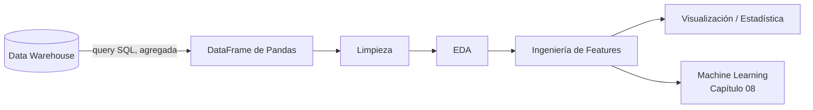

# 05 · Python

*Parte 5 · Anterior: [04. SQL](04_SQL.md)*

> 💡 **Qué vas a poder hacer después de este capítulo**
> Tomar el resultado de una query SQL y hacer todo lo que SQL hace mal: limpieza profunda, análisis exploratorio, ingeniería de features y visualización — organizado como un proyecto profesional, no como un notebook de borrador.

---

## 5.1 Dónde encaja Python (y dónde no)

> 📌 **Recuadro**
> No traigas millones de filas a Python para hacer lo que SQL ya hace bien (agregación, filtrado, joins). Usá SQL para que el warehouse haga el trabajo pesado, y después traé el *resultado* a Python para lo que SQL no hace bien: modelado estadístico, lógica de limpieza compleja y visualización rica.



## 5.2 Pandas y NumPy

```python
import pandas as pd
import numpy as np

df = pd.read_sql("SELECT * FROM vw_revenue_mensual_categoria", conn)
df.head()
df.info()
df.describe()
```

NumPy es la base de Pandas — lo vas a usar directamente para matemática vectorizada y manejo de `NaN`:

```python
df['revenue_log'] = np.log1p(df['revenue'])
```

> 🏢 **Ejemplo real de empresa**
> Los analistas en empresas como **Rappi** o **Amazon** rara vez cargan tablas crudas de millones de filas en Pandas — agregan en SQL primero (ver [04.7](04_SQL.md#47-performance-índices-y-optimización)), y después traen unas pocas miles de filas resumidas a Python para el análisis que SQL no puede expresar.

## 5.3 Limpieza

```python
df = df.drop_duplicates()
df['email'] = df['email'].str.strip().str.lower()
df['fecha_registro'] = pd.to_datetime(df['fecha_registro'], errors='coerce')
df['revenue'] = df['revenue'].fillna(0)
```

> ⚠️ **Error común**
> Descartar filas con datos faltantes con `dropna()` sin chequear *cuánto* dato estás perdiendo o *por qué*. Siempre chequeá `df.isna().sum()` primero y entendé si la ausencia de datos es aleatoria o significativa (ej: "revenue es nulo" podría significar "el pedido se canceló," no "error de datos").

## 5.4 Análisis Exploratorio de Datos (EDA)

```python
df['categoria'].value_counts()
df.groupby('categoria')['revenue'].agg(['sum', 'mean', 'count'])
df.corr(numeric_only=True)
```

El EDA responde: ¿cómo es realmente este dato, hay outliers, hay sorpresas, algo contradice lo que asumen los stakeholders?

## 5.5 Ingeniería de Features

```python
df['mes_pedido'] = df['fecha_pedido'].dt.to_period('M')
df['es_finde'] = df['fecha_pedido'].dt.dayofweek >= 5
df['revenue_por_unidad'] = df['revenue'] / df['cantidad']
```

La ingeniería de features es donde el conocimiento del negocio se convierte en una columna que un modelo o un gráfico puede usar directamente — el puente hacia el [Capítulo 08 (Machine Learning)](08_Machine_Learning.md).

## 5.6 Visualización y Estadística

```python
import matplotlib.pyplot as plt
import seaborn as sns

sns.lineplot(data=df, x='mes_pedido', y='revenue', hue='categoria')
plt.title('Revenue Mensual por Categoría')
plt.show()
```

Acompañá cada gráfico con la estadística que lo respalda — un promedio sin una noción de dispersión (desvío estándar, IQR) puede confundir a un stakeholder.

> ✅ **Buena práctica**
> Preguntate siempre "¿comparado con qué?" Un número solo ("el revenue fue $2M el mes pasado") no significa nada sin una comparación — mes contra mes, año contra año, o contra un objetivo.

## 5.7 Organización de proyectos, logging, entornos virtuales

```
proyecto/
├── data/
├── notebooks/
├── src/
│   ├── clean.py
│   ├── features.py
│   └── analysis.py
├── requirements.txt
├── .gitignore
└── README.md
```

```bash
python -m venv .venv
source .venv/bin/activate      # o .venv\Scripts\activate en Windows
pip install pandas numpy matplotlib seaborn
pip freeze > requirements.txt
```

```python
import logging
logging.basicConfig(level=logging.INFO)
logger = logging.getLogger(__name__)
logger.info(f"Se cargaron {len(df)} filas después de limpiar")
```

> ✅ **Buena práctica**
> Un **entorno virtual** por proyecto + un `requirements.txt` versionado es lo que separa "un script que corrió en mi máquina una vez" de un proyecto que un compañero realmente puede reproducir. Este es exactamente el hábito en el que te vas a apoyar para los [10 proyectos de portfolio](../proyectos/).

---

## Resumen del capítulo

- Dejá que SQL agregue; dejá que Python limpie, explore, cree features y visualice.
- Siempre cuantificá los datos faltantes antes de descartarlos, y siempre comparás números contra algo.
- Estructurá cada proyecto con `venv` + `requirements.txt` + logging desde el día uno — es un hábito de cinco minutos que hace tu trabajo reproducible.

**Siguiente:** [06. Power BI →](06_Power_BI.md) — convirtiendo este análisis en un dashboard que los stakeholders realmente usen.
