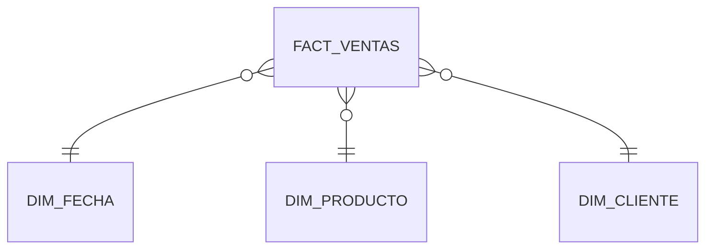
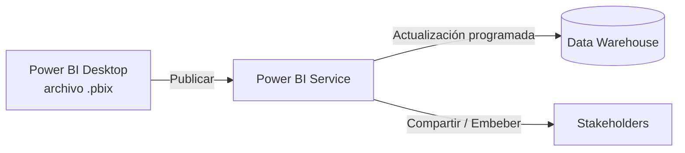

# 06 · Power BI

*Parte 6 · Anterior: [05. Python](05_Python.md)*

> 💡 **Qué vas a poder hacer después de este capítulo**
> Construir un dashboard real desde cero: cargar y modelar datos, escribir medidas DAX, y publicar algo en lo que un Product Manager o un ejecutivo realmente confiaría.

---

## 6.1 Power Query

Power Query es la capa de carga y transformación de datos de Power BI (Obtener Datos → Transformar). Pensalo como una interfaz gráfica para muchos de los pasos de limpieza que hiciste en el [Capítulo 05](05_Python.md#53-limpieza), excepto que acá se compilan en un pipeline reutilizable y actualizable.

> ✅ **Buena práctica**
> Hacé la transformación pesada río arriba (SQL/dbt en el warehouse) y dejá Power Query para transformaciones livianas — renombrar, convertir tipos, filtros simples. Un modelo que se apoya en el warehouse para la lógica es más fácil de debuggear y mucho más rápido de actualizar.

## 6.2 Modelado de Datos y Relaciones

Power BI quiere que tu dato esté modelado de la misma forma que aprendiste en el [Capítulo 03](03_Bases_de_Datos.md#33-star-schema-vs-snowflake-schema): un **Star Schema** con una tabla de hechos y varias tablas de dimensión, conectadas por relaciones uno-a-muchos.



> ⚠️ **Error común**
> Importar tablas anchas, planas y pre-unidas desde una planilla en vez de un star schema apropiado. Funciona para un dataset diminuto, y después se rompe rápido — filas de dimensión duplicadas, agregaciones incorrectas, y un DAX innecesariamente complicado. Modelalo bien desde el principio.

## 6.3 DAX, Medidas, KPIs

**DAX** (Data Analysis Expressions) es el lenguaje de fórmulas de Power BI. El hábito más importante: escribir **Medidas**, no **Columnas Calculadas**, para todo lo que agregues.

```dax
Revenue Total = SUM(fact_ventas[revenue])

Revenue % MoM =
VAR MesActual = [Revenue Total]
VAR MesAnterior =
    CALCULATE([Revenue Total], DATEADD(dim_fecha[fecha_completa], -1, MONTH))
RETURN
    DIVIDE(MesActual - MesAnterior, MesAnterior)
```

| | Columna Calculada | Medida |
|---|---|---|
| Se calcula | Fila por fila, guardada en el modelo | Al vuelo, según el contexto de filtro |
| Usar para | Atributos estáticos por fila (ej: `Nombre Completo`) | KPIs, agregaciones, cualquier cosa que cambie con los filtros |
| Costo | Aumenta el tamaño del modelo | Se calcula en tiempo de consulta — sin costo de almacenamiento |

> 🏢 **Caso de negocio:** Un ejecutivo filtra el dashboard a "Región = LatAm, Q2." Una **Medida** bien escrita para `Revenue Total` se recalcula automáticamente para ese contexto de filtro — una columna calculada no lo haría.

## 6.4 Dashboards, Bookmarks, Drill Through

- **Diseño de dashboard/reporte:** liderá con el KPI, respaldá con la tendencia, permití el drill-down — no enterrés la respuesta debajo de cinco gráficos de contexto.
- **Bookmarks:** guardan un estado específico de filtro/vista, se usan para construir "botones" guiados que cambian vistas del reporte.
- **Drill Through:** dejá que un usuario haga click derecho en un punto de dato (ej: una región) y salte a una página de detalle filtrada solo a esa región.

> ✅ **Buena práctica**
> Diseñá para la "lectura de 5 segundos": alguien que le echa un vistazo a tu dashboard en medio de una reunión debería obtener el número principal y su dirección (arriba/abajo vs. objetivo) sin tener que buscar.

## 6.5 Deployment, Publicación, Buenas Prácticas



> ✅ **Checklist de buenas prácticas**
> - Configurá la **actualización programada** para que el dashboard nunca muestre datos desactualizados.
> - Usá **Seguridad a Nivel de Fila (RLS)** si distintas regiones/equipos solo deberían ver sus propios datos.
> - Documentá tus medidas (Power BI soporta descripciones) para que el próximo analista no tenga que hacer ingeniería inversa de tu DAX.
> - Versioná tus archivos `.pbix` y mantené un changelog para rediseños importantes del dashboard, la misma disciplina que el [`CHANGELOG.md`](../CHANGELOG.md) de este handbook.

---

## Resumen del capítulo

- Power Query da forma liviana al dato; la transformación pesada pertenece río arriba, en SQL.
- Modelá en Star Schema — es la misma disciplina del Capítulo 03, ahora dentro de Power BI.
- Escribí **Medidas**, no Columnas Calculadas, para los KPIs — respetan el contexto de filtro.
- Publicá con actualización programada, RLS donde haga falta, y documentación, para que el dashboard sobreviva sin que vos estés en la sala.

**Siguiente:** [07. Proyectos Profesionales →](07_Proyectos_Profesionales.md) — combinando SQL, Python y Power BI en un proyecto completo y presentable.
