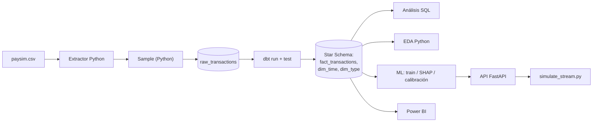

# fintech_fraud_intelligence

## Descripción

Plataforma de analítica de transacciones y detección de fraude para un producto fintech de pagos móviles (dinero móvil / wallet). Construida siguiendo la metodología de proyecto de [`Data-Analyst-Roadmap/handbook_es/07_Proyectos_Profesionales.md`](../../Data-Analyst-Roadmap/handbook_es/07_Proyectos_Profesionales.md).

---

## Problema de negocio

*"Somos una fintech de pagos móviles. Movemos millones de transacciones por mes y necesitamos entender dónde se concentra el volumen, en qué tipos de operación aparece el fraude, y qué cuentas requieren revisión — antes de que el fraude escale."*

## Objetivos

- Modelar el volumen transaccional en un Star Schema consultable por SQL y Power BI.
- Cuantificar la tasa de fraude por tipo de transacción y su tendencia diaria.
- Identificar cuentas de alto riesgo (fraude confirmado o inconsistencias de balance) para el equipo de Riesgo.
- Dejar la base lista para un modelo de clasificación de fraude ([Capítulo 08](../../Data-Analyst-Roadmap/handbook_es/08_Machine_Learning.md) — no incluido en este alcance, ver "Próximos pasos").

---

## Dataset

**PaySim — Synthetic Financial Mobile Money Transactions** (Kaggle: [`ealaxi/paysim1`](https://www.kaggle.com/datasets/ealaxi/paysim1))

- ~6.3M transacciones simuladas de un servicio de dinero móvil, distribuidas en 744 pasos horarios (~30 días).
- Tipos de transacción: `CASH_IN`, `CASH_OUT`, `DEBIT`, `PAYMENT`, `TRANSFER`.
- Incluye etiqueta de fraude real (`isFraud`) y de fraude detectado por reglas del sistema simulado (`isFlaggedFraud`).

**Descarga:** bajar `PS_20174392719_1491204439457_log.csv` desde Kaggle y guardarlo como:

```
data/raw/paysim.csv
```

---

## Diagrama de base de datos (Star Schema)

```mermaid
erDiagram
    FACT_TRANSACTIONS }o--|| DIM_TIME : ""
    FACT_TRANSACTIONS }o--|| DIM_TYPE : ""

    FACT_TRANSACTIONS {
        int time_id FK
        int type_id FK
        string origin_account_id
        string origin_account_kind
        string dest_account_id
        string dest_account_kind
        float amount
        float origin_balance_before
        float origin_balance_after
        bool is_fraud
        bool is_flagged_fraud
        bool balance_mismatch
    }
    DIM_TIME { int time_id PK, int day, int hour_of_day, bool is_weekend_sim }
    DIM_TYPE { int type_id PK, string type }
```

> **Nota de diseño — por qué no hay `dim_account`:** en PaySim cada cuenta aparece en prácticamente una sola transacción (no hay clientes recurrentes reales). Una tabla de dimensión solo tiene sentido si es *chica y reutilizable* — acá hubiera terminado casi tan grande como la tabla de hechos, lo cual rompe el propósito del modelado dimensional (ver [Capítulo 03 §3.3](../../Data-Analyst-Roadmap/handbook_es/03_Bases_de_Datos.md#33-star-schema-vs-snowflake-schema)). Por eso `account_kind` (customer/merchant) queda como columna derivada directo en el hecho.
>
> **Nota de volumen:** el dataset completo son ~6.36M transacciones, pero el plan gratuito de Neon tiene un límite de 512 MB. El pipeline conserva **el 100% de las transacciones fraudulentas** (son las que importan y son escasas) y muestrea aleatoriamente hasta 1M de transacciones no-fraudulentas — ver `sample_for_storage_budget()` en [`transform_star_schema.py`](src/application/use_cases/transform_star_schema.py). Es la misma técnica de "downsampling de la clase mayoritaria" de [Capítulo 08 §8.4](../../Data-Analyst-Roadmap/handbook_es/08_Machine_Learning.md#84-evaluación-de-modelos).

## Preguntas a responder

1. ¿En qué tipo de transacción y en qué franja horaria se concentra el volumen?
2. ¿Cuál es la tasa de fraude por tipo de transacción?
3. ¿Qué cuentas concentran más fraude confirmado o inconsistencias de balance?
4. ¿Cómo evoluciona el monto total y el monto en fraude día a día?

---

## Workflow

Dos versiones del pipeline conviven en este repo, a propósito — muestran la evolución ETL → ELT:



- **`main.py`** — la versión ETL original: Python transforma todo antes de cargar (`transform_star_schema.py`). Se mantiene como referencia de "antes".
- **`python -m src.application.use_cases.run_pipeline_elt`** — la versión **ELT recomendada**: Python solo extrae y muestrea, **dbt transforma** dentro de Postgres. Ver sección dbt más abajo.
- **SQL** ([`sql/`](sql/)): chequeo de esquema, volumen por tipo/hora, tasa de fraude por tipo, cuentas de riesgo, tendencia diaria con funciones de ventana — ver [`handbook_es/04_SQL.md`](../../Data-Analyst-Roadmap/handbook_es/04_SQL.md).
- **Python** ([`src/`](src/)): EDA con gráficos/reporte en [`reports/`](reports/) — ver [`handbook_es/05_Python.md`](../../Data-Analyst-Roadmap/handbook_es/05_Python.md).
- **Power BI** ([`powerbi/`](powerbi/)): modelo, medidas DAX y páginas sugeridas del dashboard.

## SQL en producción: de ETL a ELT con dbt

El pipeline original (`main.py`) hacía **ETL**: Python leía el CSV, lo limpiaba, lo remodelaba a Star Schema con Pandas, y recién ahí lo cargaba a Postgres. Funciona, pero la lógica de transformación queda enterrada en un script — no versionada como SQL, no testeada automáticamente, difícil de auditar para alguien que no lea Python.

La versión **ELT** (`dbt/`) invierte el orden: Python solo hace `extract` + `sample` (la única decisión que realmente pertenece a Python — no es transformación de negocio, es una decisión de ingeniería de datos por el límite de almacenamiento) y carga el dato **crudo** a `raw_transactions`. De ahí en más, **dbt transforma dentro de la base**, en SQL puro, versionado, y con tests automáticos — exactamente el patrón de [`handbook_es/02_Como_Trabajan_las_Empresas.md §2.2`](../../Data-Analyst-Roadmap/handbook_es/02_Como_Trabajan_las_Empresas.md#22-base-de-datos-operacional--data-warehouse).

```bash
python -m src.application.use_cases.run_pipeline_elt
```

Esto corre `dbt run` + `dbt test` al final. Los modelos:

| Modelo | Materialización | Qué hace |
|---|---|---|
| `dbt/models/staging/stg_transactions.sql` | view | Limpieza mínima sobre `raw_transactions` |
| `dbt/models/marts/dim_time.sql` | table | 743 pasos horarios |
| `dbt/models/marts/dim_type.sql` | table | Los 5 tipos de transacción |
| `dbt/models/marts/fact_transactions.sql` | table | La tabla de hechos — reemplaza lo que antes hacía `transform_star_schema.py` en Pandas |

**17 tests de dbt** (`unique`, `not_null`, `relationships`, `accepted_values`) corren automáticamente y deben pasar antes de confiar en los datos — ver `dbt/models/*/​_*.yml`.

Correr dbt manualmente (después de tener `raw_transactions` cargada):

```bash
cd dbt
dbt run --profiles-dir .
dbt test --profiles-dir .
```

> `profiles.yml` lee las credenciales de variables de entorno (`DBT_HOST`, `DBT_USER`, etc.) — `run_pipeline_elt.py` las arma automáticamente parseando `DATABASE_URL` del `.env`. Si corrés dbt manualmente, exportalas vos o usá el pipeline completo.

## Orquestación con Prefect (sin Docker)

Airflow necesita Docker/WSL (que a su vez necesita virtualización). **Prefect** corre como un proceso Python normal — encaja con las restricciones de esta máquina.

```bash
python -m src.interfaces.orchestrate            # corre el flow una vez, ad-hoc
```

Para verlo como un scheduler real, con reintentos y logs en una UI:

```bash
prefect server start                              # terminal 1 — UI en http://localhost:4200
python -m src.interfaces.orchestrate --serve       # terminal 2 — registra el schedule diario
```

El flow (`src/interfaces/orchestrate.py`) encadena: extract → sample → load raw → dbt run → dbt test, cada paso con reintentos automáticos y logging — la misma disciplina que tendría un pipeline real, sin necesitar contenedores.

---

## Estructura

- `src/domain/` — entidad `Transaction`, sin I/O.
- `src/application/use_cases/` — `run_pipeline.py` (ETL viejo), `run_pipeline_elt.py` (**ELT recomendado**), `transform_star_schema.py` (remodelado en Pandas, usado solo por el ETL viejo), `extract_and_sample.py` (extract+sample, usado por ELT), `train_fraud_model.py`.
- `src/infrastructure/` — `extractors/csv_extractor.py`, `repositories/postgres_repository.py` (Star Schema completo), `repositories/raw_repository.py` (solo carga cruda, para ELT).
- `src/interfaces/` — `cli.py`, `eda_report.py`, `train_model.py`, `inspect_model.py`, `compare_models.py`, `explain_predictions.py` (SHAP), `calibrate_model.py`, `train_honest_model.py`, `score_transactions.py`, `api.py` (FastAPI), `predict.py`, `simulate_stream.py`, `orchestrate.py` (Prefect).
- `dbt/` — proyecto dbt: `models/staging/`, `models/marts/`, tests.
- `sql/` — 5 queries de análisis, numeradas en orden de uso.
- `powerbi/` — modelo y medidas DAX para construir el dashboard.
- `presentation/` — landing page de portfolio (`template.html` + `build_portfolio.py`).
- `data/`, `models/`, `reports/`, `notebooks/` — artefactos generados (gitignored salvo estructura).
- `tests/unit/`, `tests/integration/`

---

## Setup

```bash
pip install -e ../../shared
pip install -e .
cp .env.example .env
```

**Base de datos:** si no tenés virtualización disponible para Docker, usá Postgres gratis en la nube ([Neon](https://neon.tech) o [Supabase](https://supabase.com)) — creá el proyecto, copiá el connection string, y pegalo en `DATABASE_URL` dentro de `.env`. Si en algún momento tenés Docker disponible, `docker compose up -d db` levanta un Postgres local en su lugar.

Descargar el dataset (ver sección Dataset) a `data/raw/paysim.csv`.

## Run

```bash
python main.py              # ETL: CSV -> Star Schema -> Postgres
python -m src.interfaces.eda_report   # EDA -> reports/*.png + resumen_eda.md
```

Después, correr las queries de [`sql/`](sql/) contra la base, y construir el dashboard siguiendo [`powerbi/README.md`](powerbi/README.md).

## Machine Learning — entrenar y experimentar

```bash
python -m src.interfaces.train_model     # entrena y guarda models/fraud_classifier.joblib
python -m src.interfaces.inspect_model   # importancia de features, barrido de umbral, comparación con/sin leakage
python -m src.interfaces.predict         # score de una transacción de ejemplo (sospechosa por defecto)
```

`predict.py` acepta overrides para armar tu propia transacción y ver qué dice el modelo:

```bash
python -m src.interfaces.predict --type PAYMENT --amount 500 --origin_balance_before 10000 --origin_balance_after 9500 --dest_account_kind merchant
```

**Hallazgo clave** (ver [`reports/reporte_modelo_fraude.md`](reports/reporte_modelo_fraude.md) e [`reports/inspeccion_modelo.md`](reports/inspeccion_modelo.md)): el modelo obtiene métricas casi perfectas (ROC-AUC 0.9997), pero `inspect_model.py` compara el ROC-AUC con y sin las features de balance sospechosas de leakage (`origin_balance_delta`, `balance_mismatch`) para verificar si el modelo realmente "aprendió fraude" o solo aprendió el patrón sintético que PaySim deja sin querer.

## Machine Learning — explicabilidad, batch scoring y API

```bash
python -m src.interfaces.compare_models        # Random Forest vs. Logistic Regression
python -m src.interfaces.explain_predictions   # SHAP: por qué el modelo predijo esto en casos individuales
python -m src.interfaces.score_transactions    # scorea todas las transacciones -> tabla fraud_scores en Postgres
```

**API en vivo** — sirve el modelo como un endpoint HTTP real (el paso hacia producción del [Capítulo 08 §8.6](../../Data-Analyst-Roadmap/handbook_es/08_Machine_Learning.md#86-deployment-el-traspaso-al-ml-engineer)):

```bash
uvicorn src.interfaces.api:app --reload --port 8000
```

```bash
curl -X POST http://localhost:8000/score -H "Content-Type: application/json" -d '{
  "amount": 181, "type": "TRANSFER",
  "origin_balance_before": 181, "origin_balance_after": 0,
  "dest_balance_before": 0, "dest_balance_after": 0,
  "origin_account_kind": "customer", "dest_account_kind": "customer"
}'
```

Documentación interactiva (Swagger) disponible en `http://localhost:8000/docs` mientras el servidor corre.

## Calibración de probabilidades

Un ROC-AUC alto no garantiza que "70% de probabilidad" signifique realmente 70% de fraude real en ese grupo — son propiedades distintas del modelo.

```bash
python -m src.interfaces.calibrate_model
```

Compara el modelo sin calibrar contra una versión calibrada con Platt scaling (`CalibratedClassifierCV`, sigmoid, 3-fold CV), y genera `reports/calibracion.png` con la curva de calibración.

## Modelo "honesto" (sin las features de leakage) en producción

El modelo de `/score` se apoya en gran parte en `origin_balance_delta`/`balance_mismatch` — el patrón sintético de PaySim (ver "El hallazgo" en el manual). `/score/honest` sirve la alternativa entrenada sin esas dos features — el candidato más realista si esto se apuntara a datos de transacciones reales:

```bash
python -m src.interfaces.train_honest_model   # entrena y guarda models/fraud_classifier_honest.joblib
```

**Resultado real** (ver [`reports/modelo_honesto.md`](reports/modelo_honesto.md)): ROC-AUC 0.9991 (casi igual al modelo completo) pero **F1 0.5562** — coherente con lo que ya habíamos visto en `inspect_model.py`. Precision de la clase fraude cae a 0.39 (más falsas alarmas), pero sigue siendo un modelo usable, solo que menos "espectacular" en el número que más se muestra en un resumen ejecutivo.

Después de correrlo, reiniciá la API para que cargue ambos modelos, y comparalos:

```bash
curl -X POST http://localhost:8000/score/honest -H "Content-Type: application/json" -d '{...}'
```

## Simulación de tiempo real

Sin Kafka ni infraestructura de streaming real, este script reproduce transacciones ya cargadas como si fueran eventos llegando uno por uno, llamando a la API en vivo — la forma más honesta de sentir el comportamiento del modelo "en producción" sin construir un sistema de streaming real.

```bash
# Terminal 1
uvicorn src.interfaces.api:app --port 8000

# Terminal 2
python -m src.interfaces.simulate_stream --n 30 --delay 0.5
```

Imprime cada transacción simulada con la predicción del modelo en vivo y si acertó contra la etiqueta real, más un resumen de aciertos al final.

## Deploy de la API (Render / Railway)

No creo la cuenta por vos — creá una gratis en [render.com](https://render.com) o [railway.app](https://railway.app), conectá este repo, y usá `render.yaml` (Render detecta el Blueprint automáticamente) o `Procfile` (Railway/Heroku-style). Configurá `DATABASE_URL` como variable de entorno en el dashboard del servicio — nunca la subas al repo.

⚠️ Antes de deployar: `models/*.joblib` está gitignored por defecto — o lo committeás explícitamente, o el pipeline de build tiene que correr `train_model.py` antes de arrancar el servicio.

## Grabar un video corto del proyecto

Mejor lo hacés vos con una herramienta de grabación de pantalla (Loom, OBS, o el grabador nativo de Windows con `Win+Alt+R`) — no algo que yo pueda generar. Guion sugerido, 2-3 min:

1. (10s) El problema de negocio — una frase.
2. (20s) `python -m src.application.use_cases.run_pipeline_elt` corriendo, mostrando el log de dbt.
3. (30s) 2-3 queries SQL con resultado.
4. (30s) El dashboard de Power BI, click por las 3 páginas.
5. (40s) `simulate_stream.py` corriendo en vivo contra la API — es el momento más "demo-able" de todo el proyecto.
6. (20s) Cierre: mostrar la landing page de portfolio (`presentation/index.html`).

---

## Dashboard esperado

3 páginas: (1) Overview ejecutivo con KPIs de monto/fraude, (2) Tendencia diaria de monto total vs. monto en fraude, (3) Desglose por tipo de transacción con drill-through a cuentas de riesgo.

## Conclusiones esperadas

Un ranking de tipos de transacción por tasa de fraude, una lista accionable de cuentas de riesgo para el equipo de Riesgo, y una cuantificación de cuánto monto está en juego — el mismo formato de Resumen Ejecutivo de [`handbook_es/07_Proyectos_Profesionales.md §7.1`](../../Data-Analyst-Roadmap/handbook_es/07_Proyectos_Profesionales.md#71-la-metodología).

## Estado del proyecto

Todo lo del plan original está hecho: modelo de clasificación, SHAP, calibración, batch scoring, API con dos modelos (completo y "honesto"), pipeline ELT con dbt, orquestación con Prefect, simulación de streaming, y una landing page de portfolio. Pendiente real, no fantasía de alcance:

- Exponer las queries de `sql/` como vistas dbt (`models/marts/` ya podría incluirlas) en vez de archivos `.sql` sueltos.
- Drill-through en Power BI (descartado por fricción de UI, ver `powerbi/README.md`).
- Deploy real de la API (los archivos de config están listos — falta que crees la cuenta en Render/Railway).

---

## Technologies

- Python (Pandas, SQLAlchemy, Matplotlib, Seaborn, scikit-learn, SHAP, FastAPI)
- PostgreSQL (Neon)
- dbt (transformación versionada y testeada)
- Prefect (orquestación sin Docker)
- Power BI

---

## Author

Facu
