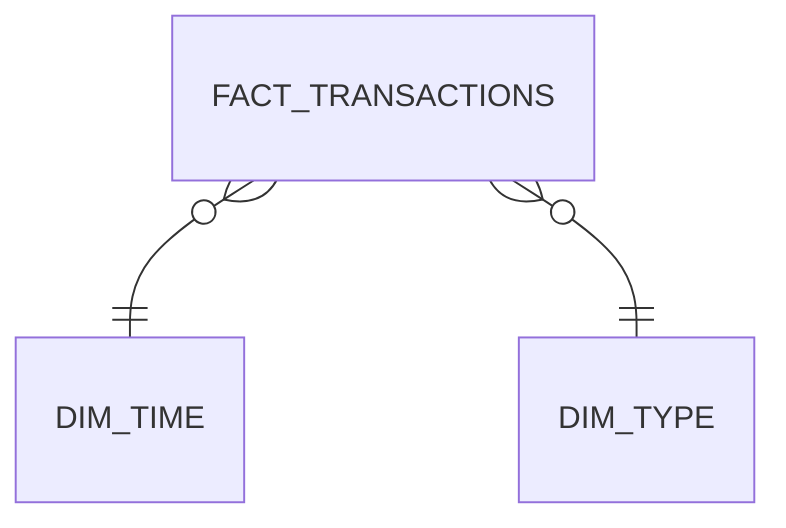

# Power BI — fintech_fraud_intelligence

No se versiona un `.pbix` binario (no es texto, y Power BI Desktop no corre desde este entorno) — en cambio, acá está todo lo necesario para construirlo en minutos: la conexión, el modelo, y las medidas DAX listas para pegar.

## 1. Conectar

`Obtener datos → PostgreSQL database` → servidor (el host de Neon, o `localhost` si usás Docker), puerto `5432`, base `fintech_fraud_intelligence` (o `neondb` si usás Neon) → importar las 3 tablas: `fact_transactions`, `dim_time`, `dim_type`.

## 2. Modelo (Star Schema)

Relaciones uno-a-muchos desde cada dimensión hacia `fact_transactions`, igual que en [`handbook_es/06_Power_BI.md §6.2`](../../Data-Analyst-Roadmap/handbook_es/06_Power_BI.md#62-modelado-de-datos-y-relaciones):



> No hay `dim_account`: en PaySim las cuentas casi no se repiten, así que `origin_account_kind`/`dest_account_kind` (customer/merchant) quedan como columnas directas en `fact_transactions` — ver la nota de diseño en el README del proyecto.

## 3. Medidas DAX

```dax
Transacciones Totales = COUNTROWS(fact_transactions)

Monto Total = SUM(fact_transactions[amount])

Transacciones Fraudulentas =
CALCULATE([Transacciones Totales], fact_transactions[is_fraud] = TRUE)

Tasa de Fraude % =
DIVIDE([Transacciones Fraudulentas], [Transacciones Totales])

Monto en Fraude = 
CALCULATE([Monto Total], fact_transactions[is_fraud] = TRUE)

Monto Total Ayer =
CALCULATE([Monto Total], DATEADD(dim_time[day], -1, DAY))

Variacion Monto vs Ayer % =
DIVIDE([Monto Total] - [Monto Total Ayer], [Monto Total Ayer])
```

## 4. Páginas del dashboard — estado

1. **Overview ejecutivo** ✅ — 4 tarjetas KPI: Monto Total, Transacciones Totales, Tasa de Fraude %, Monto en Fraude.
2. **Tendencia** ✅ — visual combinado (*Line and stacked/clustered column chart*): `Monto Total` en columnas (eje primario), `Monto en Fraude` en línea (eje secundario) por `dim_time[day]`. Un gráfico de líneas simple **no soporta** eje secundario por serie en Power BI — por eso el visual combinado, no el de líneas.
3. **Por tipo de transacción** ✅ — dos gráficos de barras por `dim_type[type]`: volumen (`Transacciones Totales`) y `Tasa de Fraude %`.

### Fuera de alcance: Drill-through a cuentas de riesgo

La tabla `cuentas_riesgo` (de [`sql/04_top_risky_accounts.sql`](../sql/04_top_risky_accounts.sql)) sí se cargó al modelo vía consulta nativa, pero la página de drill-through quedó descartada — la UI de Power BI para esto (`Filters pane → Drillthrough well`, distinto del panel Format) generó fricción que no valía la pena resolver para un proyecto de portfolio. La tabla `cuentas_riesgo` queda disponible en el modelo para consultarla como tabla suelta si hace falta el detalle fila a fila.

Si más adelante se retoma: click en canvas vacío (`Esc` primero para deseleccionar cualquier visual) → panel **Filters** (no Format) → sección **Drillthrough** arriba de todo → arrastrar `dim_type[type]` ahí.

## 5. Publicar

Seguí [`handbook_es/06_Power_BI.md §6.5`](../../Data-Analyst-Roadmap/handbook_es/06_Power_BI.md#65-deployment-publicación-buenas-prácticas) — actualización programada apuntando a la misma base Postgres, y RLS si en algún momento se separa por región/entidad.
